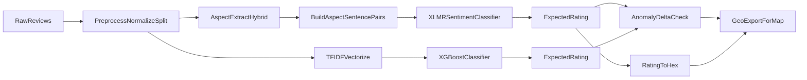

# Restaurant Reputation & Integrity Intelligence System (Blueprint)

## Goals
- **Full ABSA**: extract aspects from mixed EN/TH review text, then predict **sentiment rating 1–5** per extracted aspect.
- **Benchmark tracks**:
  - **SOTA**: Fine-tuned **`xlm-roberta-base`** (PyTorch + Hugging Face `Trainer`) for (a) aspect extraction and (b) 1–5 sentiment classification.
  - **Baseline**: **TF‑IDF + XGBoost** with **custom multilingual tokenizer** (PyThaiNLP for Thai, whitespace-ish for English), trained on combined datasets.
- **Integrity / anomaly detection**: 
  - Compute discrepancy 
    
    \[
    \Delta = |User\_Rating - AI\_Predicted\_Rating|
    \]

  - Flag anomalies if **\(\Delta \ge 2.0\)**.
- **Visualization support**: Map predicted 1–5 score to hex palette.

## Assumptions (documented defaults)
- **Input data**: reviews come as rows with at least `review_id`, `text`, `user_rating` (1–5), and optional metadata (restaurant_id, timestamp, lang).
- **Label strategy**:
  - XLM-R sentiment head is **5-class classification**.
  - To get a single AI rating for anomaly scoring and color mapping, use **expected rating**: \(\sum_{k=1..5} k \cdot p_k\).
- **Aspect extraction in production**: start with a **hybrid** approach that is robust with limited labeling:
  - Sentence segmentation → candidate aspect phrase extraction (Thai/EN heuristics + POS tags where available) → map candidates to **canonical aspect set** (e.g., `food`, `service`, `price`, `ambience`, `cleanliness`, `location`, `delivery`) using multilingual embeddings.
  - Optional later: replace candidate extraction with a trained **token-classification** extractor when you have labeled BIO tags.

## Project directory structure
Create a `src/`-based package with separations for data, models, evaluation, and serving.

- `[src/rris/__init__.py](src/rris/__init__.py)`
- `[src/rris/config.py](src/rris/config.py)`
  - Central config via `pydantic-settings` (or plain dataclasses) for paths, model names, seeds.
- `[src/rris/logging_utils.py](src/rris/logging_utils.py)`
  - `setup_logging()`; consistent JSON-ish logs.

### Data & preprocessing
- `[src/rris/data/io.py](src/rris/data/io.py)`
  - read/write parquet/csv; schema validation.
- `[src/rris/data/text.py](src/rris/data/text.py)`
  - normalization, language detection (optional), sentence splitting.
- `[src/rris/data/tokenizers.py](src/rris/data/tokenizers.py)`
  - custom tokenizer for baseline (PyThaiNLP + English tokenization).
- `[src/rris/data/datasets.py](src/rris/data/datasets.py)`
  - HF datasets creation for XLM-R; label mapping.
- `[src/rris/data/aspects.py](src/rris/data/aspects.py)`
  - aspect candidate extraction + canonical aspect mapping.

### Modeling
- `[src/rris/models/xlmr/sentiment_trainer.py](src/rris/models/xlmr/sentiment_trainer.py)`
- `[src/rris/models/xlmr/aspect_extractor.py](src/rris/models/xlmr/aspect_extractor.py)`
  - hybrid extractor now; later token-classification module.
- `[src/rris/models/baseline/tfidf_tokenizer.py](src/rris/models/baseline/tfidf_tokenizer.py)`
- `[src/rris/models/baseline/xgb_train.py](src/rris/models/baseline/xgb_train.py)`

### Evaluation & integrity
- `[src/rris/eval/metrics.py](src/rris/eval/metrics.py)`
  - accuracy, macro-F1, calibration (optional), per-language slice.
- `[src/rris/integrity/anomaly.py](src/rris/integrity/anomaly.py)`
  - discrepancy Δ and flags.

### Visualization utilities
- `[src/rris/viz/colors.py](src/rris/viz/colors.py)`
  - score→hex mapping.
- `[src/rris/viz/geo_export.py](src/rris/viz/geo_export.py)`
  - prepare data for map layers (GeoJSON/CSV).

### CLI / pipelines
- `[scripts/preprocess.py](scripts/preprocess.py)`
- `[scripts/train_xlmr_sentiment.py](scripts/train_xlmr_sentiment.py)`
- `[scripts/train_baseline_xgb.py](scripts/train_baseline_xgb.py)`
- `[scripts/evaluate.py](scripts/evaluate.py)`
- `[scripts/score_and_flag.py](scripts/score_and_flag.py)`

### Artifacts and configs
- `[configs/](configs/)` (YAMLs for experiments)
- `[data/raw/](data/raw/)`, `[data/interim/](data/interim/)`, `[data/processed/](data/processed/)`
- `[models/](models/)` (saved models)
- `[reports/](reports/)` (metrics, plots)

## Initial code architecture (skeletons)

### 1) Data preprocessing pipeline (mixed EN/TH)
Key responsibilities:
- Normalize text (unicode, whitespace, remove weird control chars)
- Identify Thai vs non-Thai segments for tokenization
- Baseline tokenizer: PyThaiNLP for Thai; regex/whitespace for English
- Create:
  - baseline features (`X_tfidf`)
  - HF dataset for XLM-R sentiment
  - sentence-level records for aspect extraction

Proposed skeleton.

```python
from __future__ import annotations

import logging
import re
from dataclasses import dataclass
from typing import Iterable, Iterator, List, Optional, Sequence, Tuple

logger = logging.getLogger(__name__)

THAI_CHAR_RE = re.compile(r"[\u0E00-\u0E7F]")
EN_TOKEN_RE = re.compile(r"[A-Za-z0-9]+(?:'[A-Za-z]+)?|[^\sA-Za-z0-9]", re.UNICODE)


def normalize_text(text: str) -> str:
    if text is None:
        raise ValueError("text is None")
    text = text.replace("\u200b", " ")  # zero-width space
    text = re.sub(r"\s+", " ", text).strip()
    return text


def contains_thai(text: str) -> bool:
    return bool(THAI_CHAR_RE.search(text))


@dataclass(frozen=True)
class MultilingualTokenizerConfig:
    keep_punct: bool = True


class MultilingualTokenizer:
    """Tokenizer for baseline TF-IDF: PyThaiNLP for Thai + regex for English."""

    def __init__(self, cfg: MultilingualTokenizerConfig) -> None:
        self.cfg = cfg
        try:
            from pythainlp.tokenize import word_tokenize as th_word_tokenize
        except Exception as e:  # pragma: no cover
            raise RuntimeError(
                "PyThaiNLP is required for Thai tokenization. Install pythainlp."
            ) from e
        self._th_word_tokenize = th_word_tokenize

    def tokenize(self, text: str) -> List[str]:
        text = normalize_text(text)
        if not text:
            return []

        if contains_thai(text):
            # You can choose engine='newmm' or others depending on your needs.
            toks = self._th_word_tokenize(text, engine="newmm", keep_whitespace=False)
            toks = [t.strip() for t in toks if t.strip()]
        else:
            toks = EN_TOKEN_RE.findall(text)

        if not self.cfg.keep_punct:
            toks = [t for t in toks if re.search(r"[A-Za-z0-9\u0E00-\u0E7F]", t)]

        return toks


def make_hf_sentiment_example(text: str, user_rating: int) -> dict:
    if user_rating not in {1, 2, 3, 4, 5}:
        raise ValueError(f"user_rating must be 1..5, got {user_rating}")
    return {"text": normalize_text(text), "label": user_rating - 1}
```

### 2) Baseline TF‑IDF + XGBoost (efficient vocab)
Key points:
- Use `TfidfVectorizer(tokenizer=..., max_features=...)`
- Use `XGBClassifier` with sensible defaults; evaluate per-language slices

```python
from __future__ import annotations

import logging
from dataclasses import dataclass
from typing import Any, Dict, List, Optional

import numpy as np
from sklearn.feature_extraction.text import TfidfVectorizer
from xgboost import XGBClassifier

from rris.data.tokenizers import MultilingualTokenizer, MultilingualTokenizerConfig

logger = logging.getLogger(__name__)


@dataclass(frozen=True)
class TfidfXgbConfig:
    max_features: int = 80_000
    ngram_range: tuple[int, int] = (1, 2)
    min_df: int = 2
    max_df: float = 0.95
    xgb_params: Dict[str, Any] = None


def build_vectorizer(cfg: TfidfXgbConfig) -> TfidfVectorizer:
    tok = MultilingualTokenizer(MultilingualTokenizerConfig(keep_punct=False))

    def _tokenize(text: str) -> List[str]:
        return tok.tokenize(text)

    return TfidfVectorizer(
        tokenizer=_tokenize,
        token_pattern=None,  # required when tokenizer is provided
        lowercase=False,     # keep as-is; Thai has no case
        max_features=cfg.max_features,
        ngram_range=cfg.ngram_range,
        min_df=cfg.min_df,
        max_df=cfg.max_df,
        sublinear_tf=True,
    )


def build_xgb(cfg: TfidfXgbConfig) -> XGBClassifier:
    params = cfg.xgb_params or {}
    # Multi-class 5-way classification: labels 0..4
    return XGBClassifier(
        objective="multi:softprob",
        num_class=5,
        tree_method=params.get("tree_method", "hist"),
        max_depth=params.get("max_depth", 8),
        learning_rate=params.get("learning_rate", 0.1),
        n_estimators=params.get("n_estimators", 400),
        subsample=params.get("subsample", 0.9),
        colsample_bytree=params.get("colsample_bytree", 0.8),
        reg_lambda=params.get("reg_lambda", 1.0),
        eval_metric="mlogloss",
        n_jobs=params.get("n_jobs", -1),
    )
```

### 3) XLM-R sentiment training with Hugging Face Trainer (PyTorch)
Key points for EN→TH gap:
- Start from an English pretraining domain (Amazon Food EN) but use multilingual backbone (XLM-R).
- Use **balanced batching** (optional) and **language-aware evaluation slices**.
- Use `Trainer` + `DataCollatorWithPadding`.
- Output probabilities to compute expected rating.

```python
from __future__ import annotations

import logging
from dataclasses import dataclass
from typing import Dict, Optional

import numpy as np
import torch
from datasets import Dataset
from transformers import (
    AutoModelForSequenceClassification,
    AutoTokenizer,
    DataCollatorWithPadding,
    Trainer,
    TrainingArguments,
)

logger = logging.getLogger(__name__)


@dataclass(frozen=True)
class XlmrSentimentConfig:
    model_name: str = "xlm-roberta-base"
    max_length: int = 256


def tokenize_dataset(ds: Dataset, tokenizer, max_length: int) -> Dataset:
    def _tok(batch: Dict[str, list]) -> Dict[str, list]:
        return tokenizer(
            batch["text"],
            truncation=True,
            max_length=max_length,
        )

    return ds.map(_tok, batched=True, desc="Tokenizing")


def compute_metrics(eval_pred):
    logits, labels = eval_pred
    preds = np.argmax(logits, axis=1)
    acc = (preds == labels).mean().item()
    return {"accuracy": acc}


def train_xlmr_sentiment(train_ds: Dataset, val_ds: Dataset, cfg: XlmrSentimentConfig, out_dir: str) -> Trainer:
    tokenizer = AutoTokenizer.from_pretrained(cfg.model_name, use_fast=True)
    model = AutoModelForSequenceClassification.from_pretrained(cfg.model_name, num_labels=5)

    train_tok = tokenize_dataset(train_ds, tokenizer, cfg.max_length)
    val_tok = tokenize_dataset(val_ds, tokenizer, cfg.max_length)

    collator = DataCollatorWithPadding(tokenizer=tokenizer)

    args = TrainingArguments(
        output_dir=out_dir,
        per_device_train_batch_size=16,
        per_device_eval_batch_size=32,
        learning_rate=2e-5,
        num_train_epochs=3,
        weight_decay=0.01,
        evaluation_strategy="epoch",
        save_strategy="epoch",
        logging_strategy="steps",
        logging_steps=50,
        load_best_model_at_end=True,
        metric_for_best_model="accuracy",
        report_to=[],
        fp16=torch.cuda.is_available(),
    )

    trainer = Trainer(
        model=model,
        args=args,
        train_dataset=train_tok,
        eval_dataset=val_tok,
        tokenizer=tokenizer,
        data_collator=collator,
        compute_metrics=compute_metrics,
    )

    trainer.train()
    trainer.save_model(out_dir)
    tokenizer.save_pretrained(out_dir)

    return trainer
```

### 4) Aspect extraction engine (hybrid now, upgradeable later)
A pragmatic “production-first” ABSA extractor when you don’t yet have labeled BIO data:
- Split into sentences
- Extract candidate aspect phrases:
  - EN: noun phrases via a lightweight rule (or spaCy if you choose)
  - TH: nouns via PyThaiNLP POS tagging (or heuristics)
- Map candidates to canonical aspects with multilingual embeddings (e.g., `sentence-transformers/paraphrase-multilingual-MiniLM-L12-v2`)

This yields `[{aspect: 'service', span: ..., text: ...}, ...]` per review, which the sentiment model can score per sentence-aspect pair.

### 5) Anomaly detection engine (Δ)
```python
from __future__ import annotations

from dataclasses import dataclass
from typing import Optional

import numpy as np


def expected_rating_from_probs(probs: np.ndarray) -> float:
    """probs: shape (5,), class order 1..5 mapped to indices 0..4."""
    if probs.shape != (5,):
        raise ValueError(f"Expected probs shape (5,), got {probs.shape}")
    if not np.isfinite(probs).all():
        raise ValueError("Non-finite probabilities")
    s = probs.sum()
    if s <= 0:
        raise ValueError("Sum of probabilities must be > 0")
    probs = probs / s
    classes = np.array([1, 2, 3, 4, 5], dtype=np.float32)
    return float((classes * probs).sum())


@dataclass(frozen=True)
class AnomalyResult:
    delta: float
    is_anomaly: bool


def anomaly_check(user_rating: float, ai_rating: float, threshold: float = 2.0) -> AnomalyResult:
    if not (1.0 <= user_rating <= 5.0):
        raise ValueError(f"user_rating out of range: {user_rating}")
    if not (1.0 <= ai_rating <= 5.0):
        raise ValueError(f"ai_rating out of range: {ai_rating}")
    delta = float(abs(user_rating - ai_rating))
    return AnomalyResult(delta=delta, is_anomaly=delta >= threshold)
```

### 6) Score-to-color mapping (required palette)
```python
from __future__ import annotations

from typing import Dict


PALETTE: Dict[int, str] = {
    1: "#e53935",
    2: "#ff9800",
    3: "#fbc02d",
    4: "#4caf50",
    5: "#00bcd4",
}


def rating_to_hex(rating: int) -> str:
    try:
        return PALETTE[int(rating)]
    except Exception as e:
        raise ValueError(f"rating must be 1..5, got {rating!r}") from e
```

## Data flow (end-to-end)


## Execution steps (what you would implement next)
- Add dependency management (`pyproject.toml` or `requirements.txt`) with: `torch`, `transformers`, `datasets`, `evaluate`, `scikit-learn`, `xgboost`, `pythainlp`, `pandas`, `numpy`, plus optional `sentence-transformers`.
- Implement `src/rris/data/tokenizers.py` and `src/rris/data/text.py` first (these are shared across both benchmarks).
- Implement baseline training script and ensure it runs end-to-end on a small sample.
- Implement XLM-R sentiment training (Trainer) with proper dataset creation and per-language evaluation.
- Implement `integrity/anomaly.py` and `viz/colors.py` early (stable utilities used by scoring/exports).
- Add `score_and_flag.py` to produce a single scored dataset containing: predicted rating, hex color, Δ, anomaly flag, plus per-aspect outputs.

## Notes on handling EN/TH gap (practical production guidance)
- Keep **normalization identical** across baselines and deep model (same cleanup).
- Evaluate slices: `lang=th`, `lang=en`, and mixed; track deltas.
- Use expected rating from softmax probabilities for smoother comparisons and stability.
- For ABSA extraction, start hybrid to ship value early; add supervised token-classification once you have labeled aspect spans.
