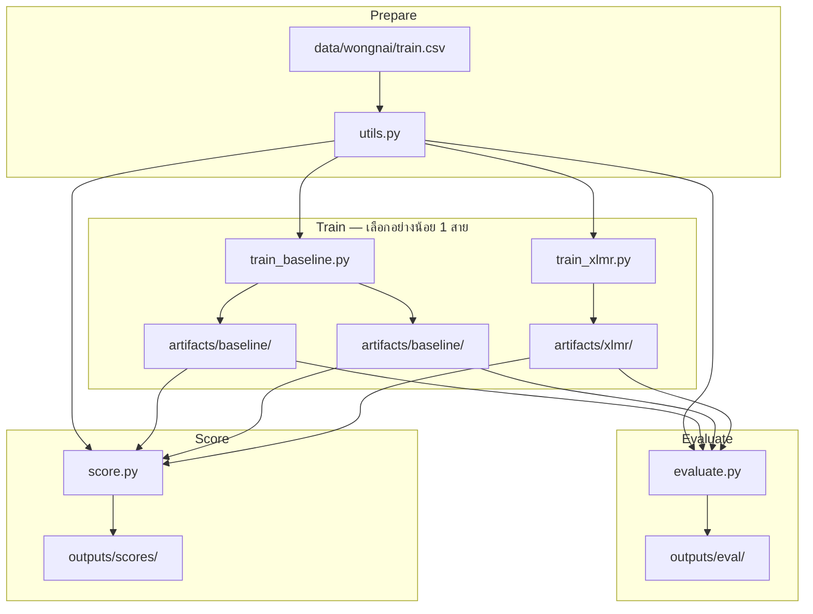

# README2 — คู่มือฉบับละเอียด (Food Review Classification · Minimal Custom Loop Edition)

เอกสารนี้อธิบายโปรเจกต์ **foods-review-classification** แบบครบทุกมิติ: เป้าหมาย, สถาปัตยกรรม, ไฟล์แต่ละตัว, พารามิเตอร์, วิธีรันในกรณีต่าง ๆ, artifacts, และการแก้ปัญหา

สำหรับ quick start สั้น ๆ ดู [README.md](README.md) ก่อน แล้วใช้ README2 เป็น reference ตอนพัฒนา / debug / ปรับ hyperparameter

---

## สารบัญ

1. [โปรเจกต์นี้คืออะไร](#1-โปรเจกต์นี้คืออะไร)
2. [แนวคิดการออกแบบ (Minimal Flat)](#2-แนวคิดการออกแบบ-minimal-flat)
3. [ภาพรวม Pipeline](#3-ภาพรวม-pipeline)
4. [โครงสร้างโฟลเดอร์และไฟล์ทั้งหมด](#4-โครงสร้างโฟลเดอร์และไฟล์ทั้งหมด)
5. [รายละเอียดทีละไฟล์](#5-รายละเอียดทีละไฟล์)
6. [ข้อมูล Input: Schema และการเตรียม](#6-ข้อมูล-input-schema-และการเตรียม)
7. [สาย A: Baseline (TF-IDF + XGBoost Native API)](#7-สาย-a-baseline-tf-idf--xgboost-native-api)
8. [สาย B: XLM-R (PyTorch Manual Loop)](#8-สาย-b-xlm-r-pytorch-manual-loop)
9. [การทำนายและตรวจ Anomaly (`score.py`)](#9-การทำนายและตรวจ-anomaly-scorepy)
10. [การประเมินโมเดล (`evaluate.py`)](#10-การประเมินโมเดล-evaluatepy)
11. [Artifacts และ Outputs](#11-artifacts-และ-outputs)
12. [วิธีใช้งานในกรณีต่าง ๆ](#12-วิธีใช้งานในกรณีต่าง-ๆ)
13. [การปรับ Hyperparameters](#13-การปรับ-hyperparameters)
14. [Dependencies](#14-dependencies)
15. [ข้อจำกัดและสิ่งที่โปรเจกต์นี้ไม่ทำ](#15-ข้อจำกัดและสิ่งที่โปรเจกต์นี้ไม่ทำ)
16. [แก้ปัญหา (Troubleshooting)](#16-แก้ปัญหา-troubleshooting)
17. [FAQ](#17-faq)

---

## 1. โปรเจกต์นี้คืออะไร

โปรเจกต์นี้เป็น **batch pipeline ด้วย Python script** สำหรับ:

1. **อ่านรีวิวร้านอาหารภาษาไทย** จากไฟล์ CSV
2. **เทรนโมเดลทำนายคะแนนดาว (1–5)** จากข้อความรีวิว — มี 2 สายให้เลือก:
   - **Baseline:** TF-IDF + XGBoost (เร็ว, เบา)
   - **Deep:** XLM-RoBERTa-base (แม่นยำกว่า แต่ช้าและใช้ RAM/GPU มากกว่า)
3. **ทำนายผล** กับข้อมูลใหม่ (หรือชุดเดิม) แล้วคำนวณ:
   - `ai_expected_rating` — คะแนนที่ AI คาดจากข้อความ (ค่าต่อเนื่อง 1.0–5.0)
   - `delta` — ความต่างจากดาวที่ผู้ใช้ให้
   - `is_anomaly` — flag รีวิวที่น่าสงสัย (delta ≥ 2)
   - `ai_hex_color` — รหัสสีสำหรับ heatmap / visualization

**ไม่มี** REST API, Docker, UI แผนที่, หรือ web app ในตัว — ผลลัพธ์เป็น **ไฟล์ CSV** ให้นำไปใช้ต่อกับเครื่องมืออื่น

### จุดเด่นของเวอร์ชัน Minimal นี้

| หัวข้อ | รายละเอียด |
|--------|------------|
| โครงสร้างแบน (Flat) | ไฟล์ Python หลักอยู่ที่ root — เปิดอ่านได้ทีละไฟล์ ไม่ต้องไล่ package ซ้อนกัน |
| XGBoost Native | ใช้ `xgb.train()` + `DMatrix` **ไม่ใช้** `XGBClassifier.fit()` |
| XLM-R Manual Loop | ใช้ PyTorch loop เอง **ไม่ใช้** Hugging Face `Trainer` |
| ควบคุมได้ | เห็น loss / metric ทุก boost round (XGB) และทุก epoch (XLM-R) ชัดเจน |

> **หมายเหตุ:** TF-IDF ยังใช้ `TfidfVectorizer.fit_transform()` ของ scikit-learn อยู่ — ข้อจำกัด “ไม่ใช้ `.fit()`” ในบริบทนี้หมายถึง **ตัว classifier / neural trainer** ไม่ใช่ vectorizer

---

## 2. แนวคิดการออกแบบ (Minimal Flat)

```
foods-review-classification/
├── config.py              ← ศูนย์รวม path + hyperparameter
├── utils.py               ← โหลดข้อมูล + ตัดคำไทย
├── train_baseline.py      ← เทรนสาย A
├── train_xlmr.py          ← เทรนสาย B
├── score.py               ← inference + anomaly
├── evaluate.py            ← metrics บนชุด test
├── visualize_eval.py      ← dashboard HTML
├── scripts/
│   ├── download_wongnai.py
│   └── generate_mock_data.py
├── data/
│   ├── wongnai/           ← train.csv, test.csv
│   └── mock/              ← train.csv, test.csv
├── artifacts/
│   ├── baseline/          ← tfidf + xgb
│   └── xlmr/              ← save_pretrained
└── outputs/
    ├── scores/            ← scored CSV
    ├── eval/              ← eval JSON + preds
    └── reports/           ← eval_report_viz.html
```

**หลักการ:**

- **Single source of truth** — ค่าคงที่ทุกอย่างอยู่ใน `config.py`
- **No package install** — รันจาก repo root ด้วย `python train_baseline.py` (import `config`, `utils` ตรง ๆ)
- **Explicit steps** — แต่ละสคริปต์พิมพ์ขั้นตอน (`Step 1`, `Step 2`, …) ให้ติดตามได้

---

## 3. ภาพรวม Pipeline



**ลำดับการทำงานมาตรฐาน:**

1. วาง CSV ที่ `data/wongnai/train.csv` + `data/wongnai/test.csv` (หรือ `python scripts/download_wongnai.py`)
2. `python train_baseline.py` และ/หรือ `python train_xlmr.py`
3. `python evaluate.py --model both` (default test: `data/wongnai/test.csv`)
4. `python visualize_eval.py` → `outputs/reports/eval_report_viz.html`
5. `python score.py` สำหรับ anomaly CSV ใต้ `outputs/scores/`

---

## 4. โครงสร้างโฟลเดอร์และไฟล์ทั้งหมด

| Path | ประเภท | Git track? | บทบาท |
|------|--------|------------|--------|
| `config.py` | Source | ✅ | ค่าคงที่ทั้งโปรเจกต์ |
| `utils.py` | Source | ✅ | โหลด/ทำความสะอาดข้อมูล + tokenizer ไทย |
| `train_baseline.py` | Source | ✅ | เทรน TF-IDF + XGBoost |
| `train_xlmr.py` | Source | ✅ | เทรน XLM-R ด้วย manual loop |
| `score.py` | Source | ✅ | Inference + anomaly + export CSV |
| `evaluate.py` | Source | ✅ | Metrics บน labeled test (baseline / xlmr / both) |
| `requirements.txt` | Config | ✅ | รายการ dependency |
| `README.md` | Docs | ✅ | Quick start |
| `README2.md` | Docs | ✅ | คู่มือฉบับนี้ |
| `.gitignore` | Config | ✅ | ไม่ commit ข้อมูล/โมเดล/venv |
| `data/wongnai/` | Data | ❌ csv | train.csv, test.csv จาก HF |
| `data/mock/` | Data | ❌ csv | ข้อมูลสังเคราะห์ |
| `artifacts/baseline/` | Model | ❌ | TF-IDF + XGBoost |
| `artifacts/xlmr/` | Model | ❌ | XLM-R weights |
| `outputs/scores/` | Result | ❌ | scored CSV |
| `outputs/eval/` | Result | ❌ | metrics JSON |
| `outputs/reports/` | Result | ❌ | HTML dashboard |
| `scripts/` | Utility | ✅ | ดาวน์โหลด / สร้าง mock |
| `.venv/` | Env | ❌ (ignore) | virtual environment (แนะนำสร้างเอง) |
| `.agents/` | Internal | ขึ้นกับ repo | checkpoint สำหรับ AI agent (ถ้ามี) |

---

## 5. รายละเอียดทีละไฟล์

### 5.1 `config.py`

**หน้าที่:** ศูนย์รวม path, device, และ hyperparameter ทั้งหมด — **ห้าม hardcode** ค่าเหล่านี้ในสคริปต์อื่น

#### Paths

| ตัวแปร | ค่าเริ่มต้น | ความหมาย |
|--------|------------|----------|
| `RAW_DATA_PATH` | `data/mock/train.csv` | ไฟล์เทรนหลัก (แก้ได้) |
| `WONGNAI_TRAIN_PATH` | `data/wongnai/train.csv` | Wongnai train |
| `WONGNAI_TEST_PATH` | `data/wongnai/test.csv` | Wongnai test (default evaluate) |
| `BASELINE_ARTIFACTS_DIR` | `artifacts/baseline/` | TF-IDF + XGB |
| `XLMR_ARTIFACTS_DIR` | `artifacts/xlmr/` | XLM-R |
| `SCORES_DIR` / `EVAL_DIR` / `REPORTS_DIR` | ใต้ `outputs/` | แยกประเภทผลลัพธ์ |

#### Device

| ตัวแปร | การกำหนด | ใช้กับ |
|--------|----------|--------|
| `TORCH_DEVICE` | `"cuda"` ถ้ามี CUDA, ไม่งั้น `"cpu"` | XLM-R train + inference |
| `XGB_DEVICE` | เหมือน `TORCH_DEVICE` | พารามิเตอร์ `device` ใน `XGB_PARAMS` |

แยก 2 ตัวเพราะ PyTorch กับ XGBoost อาจรองรับ GPU ไม่เหมือนกันบนบางเครื่อง

#### TF-IDF

| ตัวแปร | ค่าเริ่มต้น | ความหมาย |
|--------|------------|----------|
| `TFIDF_MAX_FEATURES` | `20000` | จำนวน feature (คำ/n-gram) สูงสุดใน vocabulary |

#### XGBoost (`XGB_PARAMS`)

| Key | ค่าเริ่มต้น | ความหมาย |
|-----|------------|----------|
| `objective` | `"multi:softprob"` | จำแนกหลายคลาส + คืน probability ต่อคลาส |
| `num_class` | `5` | คลาส 0–4 (แมปจากดาว 1–5) |
| `max_depth` | `6` | ความลึกสูงสุดของ tree |
| `eta` | `0.1` | learning rate |
| `eval_metric` | `"mlogloss"` | metric ตอน train/validate |
| `tree_method` | `"hist"` | histogram-based (เร็ว, รองรับ GPU) |
| `device` | `XGB_DEVICE` | `"cuda"` หรือ `"cpu"` |

| ตัวแปร | ค่าเริ่มต้น | ความหมาย |
|--------|------------|----------|
| `XGB_ROUNDS` | `100` | จำนวน boosting round สูงสุด |
| `XGB_EARLY_STOPPING_ROUNDS` | `10` | หยุดถ้า val loss ไม่ดีขึ้นติดต่อกัน N รอบ |

#### XLM-R

| ตัวแปร | ค่าเริ่มต้น | ความหมาย |
|--------|------------|----------|
| `XLMR_MODEL_NAME` | `"xlm-roberta-base"` | ชื่อ pretrained บน Hugging Face Hub |
| `MAX_LENGTH` | `256` | ความยาว token สูงสุดต่อรีวิว |
| `BATCH_SIZE` | `16` | batch ตอน train |
| `LEARNING_RATE` | `2e-5` | learning rate ของ AdamW |
| `EPOCHS` | `3` | จำนวน epoch |
| `WEIGHT_DECAY` | `0.01` | L2 regularization |

#### Scoring / Split

| ตัวแปร | ค่าเริ่มต้น | ความหมาย |
|--------|------------|----------|
| `ANOMALY_THRESHOLD` | `2.0` | ถ้า \|user_rating − ai_expected_rating\| ≥ ค่านี้ → anomaly |
| `RANDOM_STATE` | `42` | seed สำหรับ `train_test_split` |

**วิธีแก้ค่า:** เปิดแก้ใน `config.py` แล้วรันสคริปต์ใหม่ (ไม่มี CLI flag สำหรับ hyperparameter)

---

### 5.2 `utils.py`

**หน้าที่:** รวม logic การเตรียมข้อมูล — ทุกสคริปต์ train/score เรียกใช้ที่นี่

#### Constants

```python
TEXT_ALIASES = ("review_body", "text", "review")
RATING_ALIASES = ("stars", "user_rating", "rating", "star")
```

ใช้จับคู่ชื่อคอลัมน์จาก dataset ต่างแหล่งให้เป็นส키มามาตรฐาน

#### `normalize_text(text) -> str`

- แปลงเป็น string, strip ช่องว่างหัวท้าย
- ยุบ whitespace ซ้ำ ๆ เป็นช่องว่างเดียว
- คืน `""` ถ้า input เป็น `None` หรือ NaN

#### `_pick_column(columns, aliases, kind) -> str`

- หาคอลัมน์แรกที่ชื่อตรงกับ `aliases`
- ถ้าไม่เจอ → `ValueError` พร้อมรายชื่อคอลัมน์ที่มี

#### `load_and_standardize_data(file_path) -> pd.DataFrame`

**Input:** path ไป CSV ใดก็ได้ที่มีคอลัมน์ข้อความ + คะแนน

**Output:** DataFrame 2 คอลัมน์:

| คอลัมน์ | ชนิด | ขอบเขต |
|---------|------|--------|
| `text` | str | ข้อความรีวิว (ผ่าน `normalize_text`) |
| `user_rating` | int | 1–5 เท่านั้น |

**Validation:**

- คะแนนนอก 1–5 จะ raise `ValueError` ทันที

#### `thai_tokenizer(text) -> list[str]`

- เรียก `pythainlp.word_tokenize(..., engine="newmm")`
- ใช้เป็น `tokenizer=` ของ `TfidfVectorizer` ใน baseline
- ข้อความถูก normalize ก่อนตัดคำเสมอ

---

### 5.3 `train_baseline.py`

**หน้าที่:** เทรนโมเดล **TF-IDF + XGBoost** ด้วย Native API

**รัน:**

```bash
python train_baseline.py
```

**อ่าน config จาก:** `RAW_DATA_PATH`, `TFIDF_MAX_FEATURES`, `XGB_*`, `RANDOM_STATE`, `ARTIFACTS_DIR`

#### ฟังก์ชันหลัก

##### `train_xgb_native(dtrain, dval, params) -> xgb.Booster`

1. สร้าง `watchlist = [(dtrain, "train"), (dval, "val")]`
2. เรียก `xgb.train(...)` พร้อม `early_stopping_rounds`, `verbose_eval=10` (พิมพ์ metric ทุก 10 รอบ)
3. ถ้า `device=cuda` แล้วล้ม → จับ `XGBoostError`, สลับเป็น `device=cpu` แล้ว train ใหม่

##### `main()`

| Step | การทำงาน |
|------|----------|
| 1 | โหลดข้อมูลจาก `config.RAW_DATA_PATH` |
| 2 | แบ่ง train/val 80/20, `stratify=user_rating`, seed 42 |
| 3 | `TfidfVectorizer` + `fit_transform` (train) / `transform` (val) |
| 4 | แปลง label: ดาว 1–5 → class 0–4 (`rating - 1`) |
| 5 | สร้าง `xgb.DMatrix` |
| 6 | `xgb.train()` ผ่าน `train_xgb_native` |
| 7 | บันทึก `artifacts/tfidf_vectorizer.joblib` และ `artifacts/xgb_model.json` |

**สิ่งที่ไม่ได้ทำในไฟล์นี้:**

- ไม่ evaluate accuracy แยกไฟล์ (ดูจาก log `mlogloss` ระหว่าง train)
- ไม่รองรับ CLI argument — เปลี่ยน path ที่ `config.py`

**เวลารัน (โดยประมาณ):**

- ชุด Wongnai ~19k แถว: คอขวดมักอยู่ที่ **PyThaiNLP tokenize ทีละแถว** ใน TF-IDF (อาจใช้เวลาหลายนาที–สิบนาทีบน CPU)

---

### 5.4 `train_xlmr.py`

**หน้าที่:** Fine-tune **XLM-RoBERTa-base** สำหรับ classification 5 คลาส ด้วย **PyTorch loop เอง**

**รัน:**

```bash
python train_xlmr.py
```

**ครั้งแรก:** จะดาวน์โหลด weights จาก Hugging Face Hub (~1.1 GB) ไป cache ที่ `~/.cache/huggingface/`

#### Class `ReviewDataset(Dataset)`

- รับ `texts`, `labels` (0–4), `tokenizer`, `max_len`
- `__getitem__`: tokenize → `input_ids`, `attention_mask`, `labels` (tensor)
- padding แบบ `max_length` (ทุก sequence ยาวเท่ากัน)

#### `run_epoch(model, loader, optimizer=None, device=None)`

| โหมด | พฤติกรรม |
|------|----------|
| Train (`optimizer` ไม่เป็น None) | `model.train()`, zero_grad → forward → loss.backward → step |
| Eval (`optimizer` เป็น None) | `model.eval()`, `torch.set_grad_enabled(False)` |

**คืนค่า:** `(avg_loss, accuracy)` ของ epoch/loader นั้น

#### `main()`

| Step | การทำงาน |
|------|----------|
| 1 | โหลด `AutoTokenizer` + `AutoModelForSequenceClassification(num_labels=5)` |
| 2 | ย้าย model ไป `TORCH_DEVICE` |
| 3 | โหลด + split ข้อมูล (เหมือน baseline) |
| 4 | สร้าง `DataLoader` (train shuffle=True, val shuffle=False) |
| 5 | Optimizer: `torch.optim.AdamW` |
| 6 | Loop `EPOCHS` รอบ — แต่ละรอบพิมพ์ train_loss, train_acc, val_loss, val_acc |
| 7 | `save_pretrained` ไป `artifacts/xlmr_model/` |

**Head ของ classifier:** ถ้าโหลดจาก `xlm-roberta-base` ครั้งแรก ชั้น classification จะถูก **สุ่ม init ใหม่** (ปกติของ downstream task)

---

### 5.5 `score.py`

**หน้าที่:** โหลดโมเดลที่เทรนแล้ว → ทำนาย → คำนวณ anomaly → export CSV

**รัน:**

```bash
python score.py
python score.py --model xlmr
python score.py --input data/other.csv --output outputs/custom.csv
python score.py --model baseline --input data/test.csv --output outputs/test_scored.csv
```

#### CLI Arguments

| Flag | ค่าเริ่มต้น | ความหมาย |
|------|------------|----------|
| `--model` | `baseline` | `baseline` หรือ `xlmr` |
| `--input` | `config.RAW_DATA_PATH` | CSV ที่จะ score |
| `--output` | `outputs/scored_output_minimal.csv` | path ไฟล์ผลลัพธ์ |

#### ฟังก์ชันสำคัญ

##### `expected_rating_from_probs(probs)`

- `probs`: shape `(N, 5)` — ความน่าจะเป็นคลาส 0–4
- สูตร: **Expected value** ของดาว 1–5  
  `ai_expected_rating = Σ prob[i] × (i+1)`  
  (ในโค้ดใช้ dot กับ `[1,2,3,4,5]`)

##### `predict_baseline(df)`

1. โหลด `tfidf_vectorizer.joblib` + `xgb_model.json`
2. `vectorizer.transform` → `DMatrix` → `bst.predict` → probs
3. คืน array ของ expected rating

##### `predict_xlmr(df, batch_size=32)`

1. โหลด model/tokenizer จาก `artifacts/xlmr_model/`
2. ทำนายเป็น batch (default 32)
3. `softmax(logits)` → expected rating

##### `get_hex_color(rating)`

| ดาว (หลัง round) | สี Hex |
|-----------------|--------|
| 1 | `#e53935` (แดง) |
| 2 | `#ff9800` (ส้ม) |
| 3 | `#fbc02d` (เหลือง) |
| 4 | `#4caf50` (เขียว) |
| 5 | `#00bcd4` (ฟ้า) |

#### คอลัมน์ใน Output CSV

| คอลัมน์ | ความหมาย |
|---------|----------|
| `text` | ข้อความรีวิว |
| `user_rating` | ดาวที่ผู้ใช้ให้ (1–5) |
| `ai_expected_rating` | คะแนนที่ AI คาด (float, ~1.0–5.0) |
| `ai_hex_color` | สี heatmap จาก AI rating |
| `delta` | \|user_rating − ai_expected_rating\| |
| `is_anomaly` | `True` ถ้า delta ≥ `ANOMALY_THRESHOLD` (2.0) |

---

### 5.6 `evaluate.py`

**หน้าที่:** วัด MAE, RMSE, accuracy, F1, confusion matrix บนชุด test ที่มี label — import `predict_baseline` / `predict_xlmr` จาก `score.py`

**รัน:** ดู [§10 การประเมินโมเดล](#10-การประเมินโมเดล-evaluatepy)

---

### 5.7 `requirements.txt`

| Package | ใช้ทำอะไร |
|---------|-----------|
| `numpy` | เวคเตอร์, คำนวณ expected rating |
| `pandas` | อ่าน/เขียน CSV, DataFrame |
| `scikit-learn` | TF-IDF, train_test_split |
| `xgboost` | Native train + Booster inference |
| `joblib` | บันทึก/โหลด vectorizer |
| `pythainlp` | ตัดคำไทย (engine newmm) |
| `torch` | XLM-R training + inference |
| `transformers` | โหลด XLM-R model/tokenizer |

**ไม่มี version pin** — ติดตั้งเวอร์ชันล่าสุดที่ compatible กับ Python ของคุณ

**Python ที่แนะนำ:** ≥ 3.10

---

### 5.8 `.gitignore`

| Pattern | เหตุผล |
|---------|--------|
| `.venv/`, `__pycache__/` | environment และ bytecode |
| `data/*.csv` | ข้อมูลดิบไม่ commit |
| `artifacts/` | โมเดลใหญ่ สร้างใหม่ได้ |
| `outputs/` | ผลรัน สร้างใหม่ได้ |

---

## 6. ข้อมูล Input: Schema และการเตรียม

### 6.1 ชุดข้อมูลแนะนำ

[Wongnai Restaurant Review](https://huggingface.co/datasets/iamwarint/wongnai-restaurant-review) บน Hugging Face

- ดาวน์โหลด split `train` แล้วบันทึกเป็น `data/wongnai_train.csv`
- คอลัมน์มาตรฐานของชุดนี้: `review_body`, `stars` (และ metadata อื่น ๆ ที่โปรเจกต์ไม่ใช้)

### 6.2 คอลัมน์ที่รองรับ

| บทบาท | ชื่อที่รองรับ (alias) |
|--------|---------------------|
| ข้อความรีวิว | `review_body`, `text`, `review` |
| คะแนนดาว | `stars`, `user_rating`, `rating`, `star` |

ต้องมี **อย่างน้อย 1 คอลัมน์จากแต่ละกลุ่ม** — ถ้ามีหลายชื่อตรง alias จะใช้ตัวแรกที่เจอตามลำดับใน tuple

### 6.3 ข้อกำหนด

- `user_rating` ต้องเป็น integer **1, 2, 3, 4, 5** เท่านั้น
- ข้อความว่างได้ (จะกลายเป็น `""`) แต่ไม่แนะนำ
- สำหรับ `train_test_split(stratify=...)` แต่ละ class ควรมีอย่างน้อย **2 แถว** (practically มากกว่านั้นสำหรับข้อมูลจริง)

### 6.4 ดาวน์โหลดตัวอย่าง (Python)

```python
# ต้อง pip install datasets ชั่วคราว (ไม่อยู่ใน requirements.txt)
from datasets import load_dataset

ds = load_dataset("iamwarint/wongnai-restaurant-review", split="train")
ds.to_csv("data/wongnai_train.csv", index=False)
```

---

## 7. สาย A: Baseline (TF-IDF + XGBoost Native API)

### 7.1 ทำไมใช้ Native API

| วิธี | ข้อดีในโปรเจกต์นี้ |
|------|-------------------|
| `XGBClassifier.fit()` | สั้น แต่ซ่อน boosting loop |
| **`xgb.train()`** | เห็น `mlogloss` รายรอบ, ควบคุม `num_boost_round`, early stopping ตรง ๆ |

### 7.2 Label mapping

| ดาวจริง (user) | Class label (XGBoost) |
|---------------|----------------------|
| 1 | 0 |
| 2 | 1 |
| 3 | 2 |
| 4 | 3 |
| 5 | 4 |

ตอน inference: `predict` คืน prob 5 คลาส → คูณด้วย `[1,2,3,4,5]` ได้ expected ดาว

### 7.3 Log ที่ควรเห็นตอน train สำเร็จ

```
--- Step 1: Loading & Tokenizing Data ---
--- Step 2: Converting to Native DMatrix ---
--- Step 3: Training via Native API Engine (No .fit) ---
[0]	train-mlogloss:...	val-mlogloss:...
[10]	train-mlogloss:...	val-mlogloss:...
--- Step 4: Saving Trained Artifacts ---
Done baseline training!
```

Early stopping อาจหยุดก่อน 100 รอบ ถ้า val loss ไม่ดีขึ้น 10 รอบติด

---

## 8. สาย B: XLM-R (PyTorch Manual Loop)

### 8.1 ทำไมไม่ใช้ HF Trainer

Trainer รวม loop, logging, checkpoint ให้ — โปรเจกต์ minimal ต้องการเห็น:

- `optimizer.zero_grad()` / `loss.backward()` / `optimizer.step()` ชัด ๆ
- metric ต่อ epoch ที่พิมพ์เอง

### 8.2 สิ่งที่เกิดขึ้นต่อ epoch

```
Epoch 1/3 | train_loss=... train_acc=... | val_loss=... val_acc=...
```

- **train_acc / val_acc** = สัดส่วนที่ argmax(logits) ตรง class label (0–4)
- ไม่ใช่ MAE ของดาว — เป็น classification accuracy

### 8.3 ทรัพยากรที่ต้องการ

| สภาพ | RAM/เวลาโดยประมาณ |
|------|-------------------|
| CPU, Wongnai full | ช้ามาก (ชั่วโมง+) — ไม่แนะนำ |
| GPU 8GB+, Wongnai full | ใช้ได้, หลาย epoch |
| Smoke / subset | ใช้ CPU ได้สำหรับทดสอบ pipeline |

---

## 9. การทำนายและตรวจ Anomaly (`score.py`)

### 9.1 แนวคิด Integrity Check

รีวิว **anomaly** = ผู้ใช้ให้ดาว 5 แต่ข้อความอ่านแล้ว negative (AI คาด ~1.5) → delta ใหญ่ → อาจเป็น fake review, กดผิด, หรือรีวิวคนละเรื่อง

**เกณฑ์ default:** `delta >= 2.0`

| user_rating | ai_expected | delta | is_anomaly |
|-------------|-------------|-------|------------|
| 5 | 1.8 | 3.2 | True |
| 4 | 3.5 | 0.5 | False |
| 1 | 4.0 | 3.0 | True |

### 9.2 Baseline vs XLM-R ตอน score

| `--model` | ต้องมี artifact |
|-----------|----------------|
| `baseline` | `artifacts/tfidf_vectorizer.joblib`, `artifacts/xgb_model.json` |
| `xlmr` | `artifacts/xlmr_model/` (โฟลเดอร์เต็มจาก save_pretrained) |

---

## 10. การประเมินโมเดล (`evaluate.py`)

สคริปต์นี้วัดประสิทธิภาพบน **ชุดทดสอบที่มี label** — ไม่เทรน ไม่คำนวณ anomaly (ใช้ `score.py` สำหรับงานนั้น)

### 10.1 Metrics

| Metric | ความหมาย |
|--------|----------|
| MAE / RMSE | ระหว่าง `user_rating` กับ `ai_expected_rating` (ค่าต่อเนื่อง) |
| Accuracy | หลังปัดดาว 1–5 |
| F1 macro / weighted | จำแนก 5 คลาส |
| Confusion matrix | ใน terminal และ JSON |

### 10.2 CLI

```powershell
python evaluate.py --model both --input data/wongnai_test.csv --output outputs/eval_report.json
python evaluate.py --model baseline --input data/mock_test.csv
python evaluate.py --model xlmr --input data/wongnai_test.csv --save-predictions
```

| Flag | Default | ความหมาย |
|------|---------|----------|
| `--model` | `both` | `baseline`, `xlmr`, หรือ `both` |
| `--input` | `data/wongnai_test.csv` | CSV ที่มีข้อความ + ดาว (ไม่ควรเป็นไฟล์ที่ใช้เทรน) |
| `--output` | — | บันทึก metrics เป็น JSON |
| `--save-predictions` | off | `outputs/eval_baseline_preds.csv`, `outputs/eval_xlmr_preds.csv` |

ทำนาย reuse `predict_baseline` / `predict_xlmr` จาก `score.py`

### 10.3 Visualization (`visualize_eval.py`)

สร้าง dashboard HTML จาก `eval_report.json` — ตารางเปรียบเทียบ, กราฟ metrics, F1 ต่อดาว, confusion matrix

```powershell
pip install plotly
python visualize_eval.py
# เปิด outputs/eval_report_viz.html ในเบราว์เซอร์
```

| Flag | Default |
|------|---------|
| `--input` | `outputs/eval_report.json` |
| `--output` | `outputs/eval_report_viz.html` |

---

## 11. Artifacts และ Outputs

### 11.1 หลัง `train_baseline.py`

```
artifacts/
├── tfidf_vectorizer.joblib    # sklearn TfidfVectorizer (vocabulary + idf)
└── xgb_model.json             # XGBoost Booster (native format)
```

### 11.2 หลัง `train_xlmr.py`

```
artifacts/xlmr_model/
├── config.json
├── model.safetensors (หรือ pytorch_model.bin)
├── tokenizer.json
├── sentencepiece.bpe.model
└── ... (ไฟล์ tokenizer อื่น ๆ จาก save_pretrained)
```

### 11.3 หลัง `score.py`

```
outputs/scored_output_minimal.csv
```

### 11.4 หลัง `evaluate.py`

```
outputs/eval_report.json              # ถ้าระบุ --output
outputs/eval_baseline_preds.csv       # ถ้า --save-predictions
outputs/eval_xlmr_preds.csv
```

### 11.5 หลัง `visualize_eval.py`

```
outputs/eval_report_viz.html          # dashboard เปรียบเทียบโมเดล
```

---

## 12. วิธีใช้งานในกรณีต่าง ๆ

### 12.0 รันครบใน Notebook เดียว

```powershell
jupyter notebook run_pipeline.ipynb
```

หรือ **Run All** ใน VS Code / Cursor — ปรับ flag ในหัว notebook (`RUN_TRAIN_*`, `SKIP_TRAIN_IF_ARTIFACTS_EXIST`)

### 12.1 ติดตั้งครั้งแรก (Windows)

```powershell
cd F:\ComSci\Coding\Project\foods-review-classification
python -m venv .venv
.\.venv\Scripts\Activate.ps1
pip install -r requirements.txt
```

วางข้อมูลที่ `data\wongnai_train.csv`

### 12.2 เทรน → evaluate → score (ครบทั้ง 2 สาย)

```powershell
python train_baseline.py
python train_xlmr.py
python evaluate.py --model both --input data/wongnai_test.csv --output outputs/eval_report.json
python score.py
python score.py --model xlmr
```

### 12.3 ใช้แค่ Baseline (เร็ว)

```powershell
python train_baseline.py
python score.py
```

ไม่ต้องรัน `train_xlmr.py` — ไม่ต้องมี `artifacts/xlmr_model/`

### 12.4 Score ข้อมูลใหม่ (ไม่ใช่ไฟล์ train)

```powershell
python score.py --input data/new_reviews.csv --output outputs/new_scored.csv
```

**ข้อกำหนด:** CSV ต้องมีคอลัมน์ข้อความ + คะแนน (สำหรับคำนวณ delta/anomaly)  
ถ้าไม่มี `user_rating` จะ error ตอน `load_and_standardize_data`

### 12.5 เปลี่ยนไฟล์ train หลัก

แก้ `RAW_DATA_PATH` ใน `config.py` แล้วรัน train ใหม่

### 12.6 ทดสอบ pipeline ด้วยข้อมูลจำลองเล็ก ๆ

สร้าง CSV ~25 แถว (5 ดาว × 5 ประโยค) เพื่อ verify ว่า script รันผ่าน — **อย่าใช้ evaluate โมเดลจริง**

### 12.7 รันซ้ำหลังแก้ config

- แก้ `config.py` → รัน `train_*.py` ใหม่ → artifact ถูก **overwrite**
- จากนั้น `score.py` ใหม่เพื่อผลลัพธ์สอดคล้อง

---

## 13. การปรับ Hyperparameters

| ต้องการ | แก้ที่ | ผลข้างเคียง |
|---------|--------|-------------|
| ข้อมูลช้า / RAM ไม่พอ (baseline) | ลด `TFIDF_MAX_FEATURES` | vocabulary เล็กลง, อาจ accuracy ลด |
| XGB เรียนเร็ว/ช้า | `eta`, `max_depth`, `XGB_ROUNDS` | under/overfit |
| หยุด train เร็วขึ้น | `XGB_EARLY_STOPPING_ROUNDS` | อาจ underfit |
| XLM-R ช้า | ลด `EPOCHS`, `MAX_LENGTH`, `BATCH_SIZE` | คุณภาพลด |
| Anomaly เข้ม/หลวม | `ANOMALY_THRESHOLD` | 2.0 → 1.5 จะ flag มากขึ้น |
| บังคับ CPU | ตั้ง `TORCH_DEVICE = "cpu"`, `XGB_DEVICE = "cpu"` | ช้าลง |

**ไม่มี** grid search / auto-tuning ในโปรเจกต์ — ต้องลองมือแล้วดู log

---

## 14. Dependencies

### ติดตั้ง

```bash
pip install -r requirements.txt
```

### PyThaiNLP ครั้งแรก

อาจดาวน์โหลด dictionary เพิ่ม — รอสักครู่ตอน tokenize ครั้งแรก

### Hugging Face ครั้งแรก

`train_xlmr.py` / `score.py --model xlmr` ดาวน์โหลด `xlm-roberta-base` — ต้องมีอินเทอร์เน็ต

---

## 15. ข้อจำกัดและสิ่งที่โปรเจกต์นี้ไม่ทำ

| ไม่มี | หมายเหตุ |
|-------|----------|
| REST API / Web UI | ใช้ CSV batch เท่านั้น |
| Preprocess script แยก | ทำใน `utils.load_and_standardize_data` |
| ABSA (แยก aspect) | ตัดออกจากเวอร์ชัน minimal |
| GeoJSON export | มีแค่ hex color ใน CSV |
| Multilingual tokenizer (EN) | ใช้ PyThaiNLP `newmm` สำหรับไทยเท่านั้น |
| CLI สำหรับ hyperparameter | แก้ `config.py` |
| Cross-validation | แค่ single hold-out 80/20 |
| Model versioning | overwrite artifact ทุกครั้ง train |

---

## 16. แก้ปัญหา (Troubleshooting)

### `Could not find text/rating column`

- ตรวจ header CSV ให้มีชื่อตรง alias (เช่น `review_body`, `stars`)
- หรือ rename คอลัมน์ใน CSV

### `user_rating must be 1..5`

- มีคะแนน 0, 6, หรือ null — กรองแถวก่อน หรือแก้ข้อมูล

### `FileNotFoundError: data/wongnai_train.csv`

- สร้างโฟลเดอร์ `data/` และวางไฟล์
- หรือใช้ `--input` ใน `score.py`

### `FileNotFoundError` ตอน score (artifact)

```
artifacts/tfidf_vectorizer.joblib
artifacts/xgb_model.json
artifacts/xlmr_model/
```

→ รัน `train_baseline.py` หรือ `train_xlmr.py` ก่อน ให้ตรงกับ `--model`

### GPU training failed; retrying on CPU

- ปกติบน Windows ถ้า CUDA/XGBoost GPU ไม่พร้อม — script จะ fallback CPU เอง (baseline)

### XLM-R ช้ามากบน CPU

- ลด `EPOCHS` ใน config หรือใช้ GPU
- ทด subset ข้อมูลก่อน

### `UnicodeEncodeError` ตอน print ข้อความไทยใน PowerShell

- เกิดจาก encoding console (cp1252) **ไม่ใช่ bug ของ score.py**
- เปิด CSV ใน Excel/VS Code แทน หรือรัน:

```powershell
$env:PYTHONIOENCODING = "utf-8"
python score.py
```

### Hugging Face download ช้า / rate limit

- ตั้ง `HF_TOKEN` (optional) ตาม [HF docs](https://huggingface.co/docs/huggingface_hub/security-tokens)

### Stratify error ตอน split

- แต่ละ class มีแถวน้อยเกินไป (< 2) — เพิ่มข้อมูลหรือปิด stratify (ต้องแก้โค้ดใน train script)

---

## 17. FAQ

**Q: ต้องเทรนทั้ง baseline และ xlmr ไหม?**  
A: ไม่ — เลือกสายเดียวแล้ว score ด้วย `--model` ที่ตรงกัน

**Q: `ai_expected_rating` เป็นจำนวนเต็มไหม?**  
A: ไม่ — เป็นค่าทศนิยม (expected value จาก probability) เช่น 3.72

**Q: ใช้ score กับรีวิวที่ไม่มี user_rating ได้ไหม?**  
A: ไม่ได้ในเวอร์ชันปัจจุบัน — `load_and_standardize_data` บังคับมี rating

**Q: เปลี่ยน palette สีได้ไหม?**  
A: แก้ dict `HEX_COLORS` ใน `score.py`

**Q: ต่างจาก README.md ยังไง?**  
A: README = quick start; README2 = เอกสาร reference ฉบับเต็ม

**Q: commit โมเดลขึ้น git ได้ไหม?**  
A: ไม่แนะนำ — `.gitignore` ไม่ track `artifacts/` อยู่แล้ว

---

## แผนผังการอ่านโค้ด (แนะนำสำหรับมือใหม่)

1. อ่าน `config.py` — รู้ว่ามี knob อะไรบ้าง  
2. อ่าน `utils.py` — รู้รูปแบบข้อมูลเข้า  
3. อ่าน `train_baseline.py` — เข้าใจ TF-IDF + `xgb.train`  
4. อ่าน `train_xlmr.py` — เข้าใจ manual training loop  
5. อ่าน `score.py` — เข้าใจ inference + business rule anomaly  

---

*อัปเดตตามโค้ดใน repo ณ เวอร์ชัน Minimal Flat (Custom Loop Edition)*
