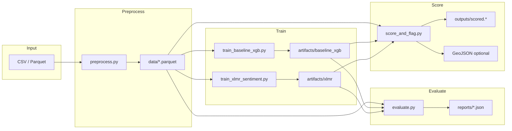

# README2 — คู่มือโปรเจกต์ฉบับละเอียด (Restaurant Review Intelligence)

เอกสารนี้เป็นคู่มือเชิงลึกสำหรับ repo **foods-review-classification** (แพ็กเกจ Python ชื่อ `rris` — *Restaurant Reputation & Integrity Intelligence System*)  
สำหรับภาพรวมสั้นๆ และตาราง benchmark ดู [README.md](README.md) ก่อน แล้วใช้ README2 เป็น reference ตอนพัฒนา / deploy / debug

| เอกสาร | ใช้เมื่อ |
|--------|---------|
| [README.md](README.md) | ภาพรวมโปรเจกต์, dataset ระดับ macro, quick start |
| **README2.md** (ไฟล์นี้) | สถาปัตยกรรม, schema, CLI ครบทุก flag, artifacts, production flow |
| [docs/ERRORS_AND_FIXES.md](docs/ERRORS_AND_FIXES.md) | อาการ error / kernel crash / pipeline mismatch |
| [docs/RUNTIME_CHECK_REPORT.md](docs/RUNTIME_CHECK_REPORT.md) | ผลรันเช็คสคริปต์/โมดูลล่าสุด (สร้างด้วย `scripts/_runtime_check.py`) |
| [food-review.ipynb](food-review.ipynb) | รัน pipeline แบบ interactive บน Wongnai |

---

## สารบัญ

1. [วัตถุประสงค์และขอบเขต](#1-วัตถุประสงค์และขอบเขต)
2. [สถาปัตยกรรมระบบ](#2-สถาปัตยกรรมระบบ)
3. [โครงสร้างโปรเจกต์](#3-โครงสร้างโปรเจกต์)
4. [การติดตั้งและสภาพแวดล้อม](#4-การติดตั้งและสภาพแวดล้อม)
5. [ข้อมูล (Data)](#5-ข้อมูล-data)
6. [คู่มือการรันแบบละเอียด (Runbook)](#6-คู่มือการรันแบบละเอียด-runbook)
7. [สคริปต์ CLI — อ้างอิงทุกพารามิเตอร์](#7-สคริปต์-cli--อ้างอิงทุกพารามิเตอร์)
8. [แพ็กเกจ `rris` (โมดูลหลัก)](#8-แพ็กเกจ-rris-โมดูลหลัก)
9. [โมเดลและพารามิเตอร์ภายใน](#9-โมเดลและพารามิเตอร์ภายใน)
10. [Artifacts และไฟล์ผลลัพธ์](#10-artifacts-และไฟล์ผลลัพธ์)
11. [Integrity, สี, GeoJSON](#11-integrity-สี-geojson)
12. [Aspect-Based Sentiment (ABSA)](#12-aspect-based-sentiment-absa)
13. [GPU / CPU / ประสิทธิภาพ](#13-gpu--cpu--ประสิทธิภาพ)
14. [Notebook `food-review.ipynb`](#14-notebook-food-reviewipynb)
15. [การนำไปใช้ Production (ไม่มี REST API)](#15-การนำไปใช้-production-ไม่มี-rest-api)
16. [การพัฒนาและแก้ปัญหา](#16-การพัฒนาและแก้ปัญหา)
17. [Dependencies และเวอร์ชัน](#17-dependencies-และเวอร์ชัน)

---

## 1. วัตถุประสงค์และขอบเขต

### 1.1 ทำอะไร

ระบบนี้รับ **ข้อความรีวิวร้านอาหาร** (+ คะแนนดาวที่ผู้ใช้ให้ 1–5) แล้ว:

1. **ทำนาย sentiment / คะแนนที่คาดหวังจากข้อความ** (`ai_expected_rating`, class 1–5)
2. **แมปเป็นสี hex** สำหรับ heatmap / แผนที่ (`ai_hex_color`)
3. **ตรวจความสอดคล้อง** ระหว่างดาวผู้ใช้กับ AI — ถ้า `|user_rating - ai_expected_rating| ≥ 2` จะ flag `is_anomaly`
4. **(ทางเลือก)** สกัด **aspect** (food, service, price, …) จากประโยคในรีวิว

### 1.2 สิ่งที่ repo นี้มี / ไม่มี

| มี | ไม่มี (ณ ตอนนี้) |
|----|------------------|
| สคริปต์ CLI ใน `scripts/` | REST API / FastAPI service |
| แพ็กเกจ `src/rris/` | Docker / Kubernetes manifests |
| Train/eval/score baseline + XLM-R | UI แผนที่ (ต้อง consume GeoJSON/CSV เอง) |
| Notebook demo Wongnai | MLOps (W&B, MLflow) ในสคริปต์หลัก |

การ “production” ในที่นี้หมายถึง: **เทรนโมเดล → บันทึก artifacts → รัน batch scoring → ส่งไฟล์ `outputs/` ให้แอปแผนที่**

### 1.3 โมเดลที่เปรียบเทียบ

| โมเดล | ที่อยู่ในโค้ด | จุดแข็ง | จุดอ่อน |
|-------|----------------|---------|---------|
| **TF-IDF + XGBoost** | `src/rris/models/baseline/` | เร็วกว่าเมื่อ artifacts พร้อม, ไม่ต้อง GPU ตอน inference | ตัดคำ PyThaiNLP ช้าตอน train/eval ชุดใหญ่ |
| **Fine-tuned XLM-RoBERTa** | `src/rris/models/xlmr/` | ความแม่นยำสูงขึ้นในภาษาผสม | เทรน/ inference หนัก, ต้องการ VRAM |

---

## 2. สถาปัตยกรรมระบบ

### 2.1 Data flow



### 2.2 Import path (`_bootstrap`)

สคริปต์ทุตัวใน `scripts/` บรรทัดแรก (หลัง docstring) คือ:

```python
import _bootstrap  # noqa: F401
```

`scripts/_bootstrap.py` แทรก `src/` เข้า `sys.path` เพื่อ `import rris` ได้โดยไม่ต้อง `pip install -e .`  
สำหรับ Jupyter หรือ import ใน notebook โดยตรง แนะนำ `pip install -e .` จาก root

### 2.3 ชั้น logic

```
scripts/*.py          → CLI, argparse, orchestration
src/rris/data/        → โหลดข้อมูล, normalize, aspects, tokenizers
src/rris/models/      → baseline (TF-IDF+XGB), xlmr (HF Trainer)
src/rris/integrity/   → expected rating, anomaly
src/rris/viz/         → สี, GeoJSON
src/rris/progress.py  → tqdm wrappers
```

---

## 3. โครงสร้างโปรเจกต์

```
foods-review-classification/
├── README.md                 # ภาพรวม + quick start
├── README2.md                # คู่มือฉบับนี้
├── pyproject.toml            # แพ็กเกจ rris (setuptools, Python >=3.10)
├── requirements.txt          # dependencies หลัก
├── food-review.ipynb         # pipeline Wongnai แบบ subprocess
├── docs/
│   └── ERRORS_AND_FIXES.md   # คatalog error จาก runtime จริง
├── data/                     # ข้อมูล (gitignore ตาม .gitignore)
│   └── wongnai-restaurant-review_train.csv   # ตัวอย่างในเครื่อง dev (ถ้ามี)
├── scripts/
│   ├── _bootstrap.py
│   ├── _scratch_init.py
│   ├── preprocess.py
│   ├── train_baseline_xgb.py
│   ├── train_xlmr_sentiment.py
│   ├── evaluate.py
│   └── score_and_flag.py
├── src/rris/                 # แพ็กเกจหลัก
├── artifacts/                # โมเดลที่เทรนแล้ว (gitignore)
├── reports/                  # metrics JSON (gitignore)
└── outputs/                  # scored tables, GeoJSON (gitignore)
```

โฟลเดอร์มาตรฐานจาก `rris.config.default_paths()` (อ้างอิง ไม่บังคับสร้างอัตโนมัติทุกตัว):

| Path | ความหมาย |
|------|----------|
| `data/raw/` | ข้อมูลดิบ (ตาม convention) |
| `data/interim/` | ขั้นกลาง |
| `data/processed/` | หลัง preprocess |
| `models/` | legacy name ใน config (artifacts จริงมักอยู่ `artifacts/`) |
| `reports/` | ผล evaluate |
| `outputs/` | ผล score |

---

## 4. การติดตั้งและสภาพแวดล้อม

### 4.1 ความต้องการ

- **Python ≥ 3.10** (จาก `pyproject.toml`)
- **OS:** ทดสอบบน Windows 10/11 + PowerShell; Linux/macOS ใช้ได้ (เปลี่ยนคำสั่ง activate venv)
- **RAM:** แนะนำ ≥ 16 GB สำหรับ Wongnai ~19k แถว + `n_jobs` สูง
- **GPU (ทางเลือก):** NVIDIA + CUDA สำหรับ XLM-R และ XGBoost `--device cuda/auto`

### 4.2 ติดตั้ง (Windows PowerShell)

```powershell
cd f:\path\to\foods-review-classification
python -m venv .venv
.\.venv\Scripts\Activate.ps1
python -m pip install --upgrade pip
pip install -r requirements.txt
pip install -e .
```

| วิธีใช้ `rris` | เมื่อไหร่ |
|----------------|----------|
| `pip install -e .` | พัฒนา, notebook, `import rris` ใน Python |
| `_bootstrap` เท่านั้น | รัน `python scripts/...` โดยไม่ติดตั้งแพ็กเกจ |

### 4.3 ตัวแปรสภาพแวดล้อมที่มีประโยย

| ตัวแปร | ผล |
|--------|-----|
| `HF_HOME` | ย้าย cache โมเดล Hugging Face ออกจาก drive C |
| `RRIS_SCRATCH_DIR` | โฟลเดอร์ temp ถาวร (เทียบเท่า `--scratch_dir` ทุกสคริปต์) |
| `CUDA_VISIBLE_DEVICES` | จำกัด GPU ที่ใช้ |

### 4.4 เลือกไดรฟ์ / โฟลเดอร์ temp (`--scratch_dir`)

ใช้เมื่อ **C: เหลือพื้นที่น้อย** หรือเจอ `XGBoost bad_malloc`

> **สำคัญ:** ใช้ไดรฟ์ที่**มีจริงบนเครื่องคุณ** (เช่น `F:\`, `E:\`) — **อย่า** copy ตัวอย่าง `D:\` ถ้าไม่มีไดรฟ์ D:  
> ตรวจไดรฟ์: `Get-PSDrive -PSProvider FileSystem`

```powershell
# วิธี 1 — flag (ทุกสคริปต์หลัก)
--scratch_dir "F:\rris-scratch"

# วิธี 2 — env ครั้งเดียวใน session
$env:RRIS_SCRATCH_DIR = "F:\rris-scratch"

# วิธี 3 — โฟลเดอร์ใน repo (repo อยู่บน F: อยู่แล้ว)
--scratch_dir "F:\ComSci\Coding\Project\foods-review-classification\.cache\tmp"
```

| สิ่งที่ถูกตั้ง | ค่า |
|----------------|-----|
| `TEMP`, `TMP`, `TMPDIR` | โฟลเดอร์ที่เลือก |
| `JOBLIB_TEMP_FOLDER`, `LOKY_TEMP` | เดียวกัน (parallel/joblib) |
| `HF_HOME` | `<scratch>/huggingface` (ถ้ายังไม่ตั้ง `HF_HOME` เอง) |

**โค้ด:** `src/rris/runtime_env.py`, `scripts/_scratch_init.py`  
**อัตโนมัติ:** ถ้า C: ว่าง &lt; ~2 GB → ใช้ `<repo>/.cache/tmp`  
**คู่มือรันครบทุกเคส:** [§6](#6-คู่มือการรันแบบละเอียด-runbook)

### 4.5 การรันสคริปต์

- **Working directory:** ต้องเป็น **root ของ repo** (โฟลเดอร์ที่มี `scripts/` และ `src/`)
- **Progress:** ทุกสคริปต์รองรับ `--no_progress` เพื่อปิด `tqdm`
- **Log:** `--log_level DEBUG|INFO|WARNING|...` (ผ่าน `rris.logging_utils`)

---

## 5. ข้อมูล (Data)

### 5.1 สคีมามาตรฐาน

หลัง `read_reviews()` (และหลัง preprocess ถ้ามี labels):

| คอลัมน์ | ชนิด | จำเป็น | คำอธิบาย |
|---------|------|--------|----------|
| `text` | string | ใช่ | ข้อความรีวิว |
| `user_rating` | int 1–5 | train / evaluate / score | ดาวที่ผู้ใช้ให้ |
| `lang` | string | ไม่ | evaluate แยกตามภาษาได้ |
| `lat`, `lon` | float | ไม่ | สำหรับ `--geojson_out` |
| `review_id` | string | ไม่ | GeoJSON `id`; score สร้าง index ถ้าไม่มี |

### 5.2 การแมปชื่อคอลัมน์อัตโนมัติ (`io._rename_aliases`)

**ข้อความ → `text`:**  
`text`, `review`, `Review`, `review_body`, `content`, `comment`, `review_text`

**ดาว → `user_rating`:**  
`user_rating`, `rating`, `Rating`, `stars`, `score`, `label`, `star`, `rate`

### 5.3 ไฟล์ Wongnai ใน repo (ตัวอย่างที่วัดได้)

ไฟล์: `data/wongnai-restaurant-review_train.csv`

| สถิติ | ค่า (วัดจาก runtime) |
|--------|----------------------|
| จำนวนแถว | **19,458** |
| คอลัมน์ | `review_body`, `stars` |
| การกระจาย `stars` | 1:245, 2:583, 3:4300, 4:7989, 5:6341 |

### 5.4 ไฟล์ที่มักใช้ผิด

| ไฟล์ | ปัญหา |
|------|--------|
| `wongnai-corpus.csv` (คอลัมน์เดียว ไม่มี header) | ไม่มี `user_rating` — ใช้ preprocess ได้ แต่ **เทรนไม่ได้** |
| `wongnai-restaurant-review_train.csv` | ถูกต้องสำหรับ train/eval |
| Parquet หลัง preprocess จาก text-only | อาจมีแค่ `text` |

### 5.5 CSV คอลัมน์เดียว / ไม่มี header

`io._load_csv_reviews` ตรวจว่าแถวแรกถูกอ่านเป็นชื่อคอลัมน์ยาวๆ แล้ว **อ่านใหม่** ด้วย `header=None, names=["text"]`

### 5.6 การ normalize ข้อความ

`rris.data.text.normalize_text`:

- ตัด control characters
- รวม whitespace
- ไม่ทำ stemming หนัก — ใช้ร่วมกับ tokenizer ตอน TF-IDF

`preprocess.py` เรียก `read_reviews(..., require_rating=False)` จึง preprocess ไฟล์ไม่มีดาวได้

---

## 6. คู่มือการรันแบบละเอียด (Runbook)

ส่วนนี้รวมคำสั่ง PowerShell สำหรับ **ทุกเคสที่ใช้บ่อย** — copy ไปรันได้จาก root โปรเจกต์  
ตัวแปรที่ใช้ซ้ำ (ปรับ path ตามเครื่องคุณ):

```powershell
# เปิด venv ก่อนทุกเคส
cd F:\ComSci\Coding\Project\foods-review-classification
.\.venv\Scripts\Activate.ps1

$RAW      = "data\wongnai-restaurant-review_train.csv"
$PROC     = "data\wongnai_processed.parquet"
$ART_BASE = "artifacts\baseline_xgb"
$ART_XLMR = "artifacts\xlmr"
$SCRATCH  = "F:\ComSci\Coding\Project\foods-review-classification\.cache\tmp"   # เปลี่ยนได้ — ดู §6.1
```

---

### 6.0 ก่อนรันทุกครั้ง (Checklist)

| ขั้น | ตรวจ |
|------|------|
| 1 | `cd` ไปที่ root ที่มี `scripts\` และ `src\` |
| 2 | venv เปิดแล้ว (`(.venv)` ใน prompt) |
| 3 | มีไฟล์ input (`data\wongnai-restaurant-review_train.csv` หรือ parquet ที่เตรียมแล้ว) |
| 4 | รู้ว่าไดรฟ์ไหนมีพื้นที่ว่าง (`Get-PSDrive -PSProvider FileSystem`) |
| 5 | ถ้าเคยเจอ `bad_malloc` / C: เต็ม → ใส่ `--scratch_dir` ทุกคำสั่ง (§6.4) |

รันช่วยตรวจแพ็กเกจ:

```powershell
python -c "import rris; import xgboost; import torch; print('ok', rris.__file__)"
python scripts/train_baseline_xgb.py --help
```

---

### 6.1 เช็กไดรฟ์ Windows (ก่อนใส่ `--scratch_dir`)

```powershell
Get-PSDrive -PSProvider FileSystem | Format-Table Name, Root, @{N='FreeGB';E={[math]::Round($_.Free/1GB,2)}}
```

| อาการ | สาเหตุ | แก้ |
|--------|--------|-----|
| `FileNotFoundError: 'D:\\'` | ไม่มีไดรฟ์ D: | ใช้ `F:\` หรือ `E:\` ที่มีในรายการ |
| `Scratch path drive does not exist` | ใส่ตัวอักษรผิด | ดูข้อความ `Available drives: C:, E:, F:` |

ตัวอย่าง scratch ที่ใช้ได้บนเครื่องที่ repo อยู่บน **F:**:

```powershell
# สร้างครั้งเดียว (ถ้ายังไม่มี)
New-Item -ItemType Directory -Force -Path "F:\rris-scratch"

$SCRATCH = "F:\rris-scratch"
# หรือ
$SCRATCH = "F:\ComSci\Coding\Project\foods-review-classification\.cache\tmp"
```

ส่งในทุกคำสั่ง: `` `--scratch_dir "$SCRATCH"` ``  
หรือตั้ง env: `$env:RRIS_SCRATCH_DIR = $SCRATCH`

---

### 6.2 เคส 1 — Pipeline เต็ม (Wongnai ~19,458 แถว, Baseline)

**ใช้เมื่อ:** เทรน baseline จริงครั้งแรก / ต้องการ artifacts สำหรับ evaluate + score  
**เวลาโดยประมาณ:** tokenize หลายสิบนาทีบน CPU; XGB หลัง vectorize อีกช่วงหนึ่ง

```powershell
# ขั้น 1 — Preprocess
python scripts/preprocess.py `
  --input $RAW `
  --out $PROC `
  --scratch_dir $SCRATCH

# ขั้น 2 — Train baseline (แนะนำเมื่อ RAM/ดิสก์จำกัด)
python scripts/train_baseline_xgb.py `
  --input $PROC `
  --out_dir $ART_BASE `
  --scratch_dir $SCRATCH `
  --device cpu `
  --n_jobs 1 `
  --max_features 25000

# ขั้น 3 — Evaluate (บนไฟล์เดียวกับที่ train)
python scripts/evaluate.py `
  --input $PROC `
  --model_type baseline_xgb `
  --artifact_dir $ART_BASE `
  --out reports/baseline_metrics.json `
  --scratch_dir $SCRATCH `
  --n_jobs 4

# ขั้น 4 — Score + anomaly + สี
python scripts/score_and_flag.py `
  --input $PROC `
  --model_type baseline_xgb `
  --artifact_dir $ART_BASE `
  --out outputs/scored.parquet `
  --scratch_dir $SCRATCH `
  --skip_aspects `
  --n_jobs 4
```

**ผลที่ได้:**

| Path | เนื้อหา |
|------|---------|
| `data/wongnai_processed.parquet` | ข้อความ normalize แล้ว |
| `artifacts/baseline_xgb/tfidf_vectorizer.joblib` | TF-IDF |
| `artifacts/baseline_xgb/xgb_model.json` | XGBoost |
| `artifacts/baseline_xgb/metrics.json` | metrics ชุด train |
| `reports/baseline_metrics.json` | metrics บนไฟล์ evaluate |
| `outputs/scored.parquet` | คอลัมน์ AI + anomaly + สี |

---

### 6.3 เคส 2 — Smoke / ทดลองเร็ว (ไม่รอทั้ง 19k)

**ใช้เมื่อ:** ทดสอบว่าติดตั้งถูก / debug / เครื่องช้า

```powershell
python scripts/train_baseline_xgb.py `
  --input $RAW `
  --out_dir artifacts/baseline_smoke `
  --scratch_dir $SCRATCH `
  --max_rows 2000 `
  --device cpu `
  --n_jobs 2 `
  --max_features 15000

python scripts/evaluate.py `
  --input $RAW `
  --model_type baseline_xgb `
  --artifact_dir artifacts/baseline_smoke `
  --out reports/smoke_metrics.json `
  --scratch_dir $SCRATCH `
  --n_jobs 2

python scripts/score_and_flag.py `
  --input $RAW `
  --model_type baseline_xgb `
  --artifact_dir artifacts/baseline_smoke `
  --out outputs/smoke_scored.parquet `
  --scratch_dir $SCRATCH `
  --skip_aspects `
  --n_jobs 2
```

> **หมายเหตุ:** ถ้า train ใช้ `--max_rows 2000` แต่ evaluate ใช้ CSV เต็ม ~19k → metrics จะไม่สะท้อนโมเดล smoke (ดู §6.14)

---

### 6.4 เคส 3 — C: เต็ม / `XGBoost bad_malloc`

**อาการ:** `bad_malloc: Failed to allocate … bytes` หรือ `RuntimeError: XGBoost could not allocate memory`

| ลำดับ | ทำ |
|--------|-----|
| 1 | เว้นพื้นที่ **C:** อย่างน้อยหลาย GB (pagefile ยังอยู่ C:) |
| 2 | ใช้ `--scratch_dir` บน **F:** หรือ **E:** (§6.1) |
| 3 | ลด `--max_features` (เช่น `25000` หรือ `15000`) |
| 4 | ใช้ `--n_jobs 1` (ไม่ใช่ `4` หรือ `-1`) |
| 5 | ใช้ `--device cpu` ใน Jupyter ที่โหลด torch แล้ว |

```powershell
python scripts/train_baseline_xgb.py `
  --input $PROC `
  --out_dir $ART_BASE `
  --scratch_dir "F:\rris-scratch" `
  --device cpu `
  --n_jobs 1 `
  --max_features 25000
```

ถ้า C: ว่างพอ (~10 GB+) อาจไม่ต้อง `--scratch_dir` แต่ยังแนะนำ `--n_jobs 1` สำหรับชุดเต็ม

---

### 6.5 เคส 4 — รันใน Jupyter (`food-review.ipynb`)

**ใช้เมื่อ:** ต้องการรันทีละขั้นแบบ interactive

1. เปิด notebook จาก **repo root**
2. รัน **Section 1 Setup** หรือ **Section 3 Paths** (มี `ROOT`, `run_script`)
3. ใน Paths cell ตั้ง:

```python
SCRATCH_DIR = str(ROOT / ".cache" / "tmp")   # หรือ r"F:\rris-scratch"
TRAIN_DEVICE = "cpu"
NOTEBOOK_N_JOBS = 4          # evaluate/score; train ใช้ 1 ถ้า crash
DEMO_MAX_ROWS = 5000         # None = เต็มชุด
SKIP_ASPECTS_ON_SCORE = True
```

4. รัน cell ตามลำดับ: Preprocess → Train → Evaluate → Score  
   ทุก `run_script(...)` ส่ง `*scratch_args()` อัตโนมัติแล้ว

**CLI เทียบเท่า** (รันนอก notebook — แนะนำถ้า kernel crash):

```powershell
python scripts/train_baseline_xgb.py --input data/wongnai_processed.parquet --out_dir artifacts/notebook_baseline --device cpu --n_jobs 1 --max_rows 5000 --scratch_dir $SCRATCH
```

---

### 6.6 เคส 5 — Train Baseline เท่านั้น (รายละเอียด flag)

| เป้าหมาย | คำสั่งเพิ่ม |
|----------|------------|
| เร็ว / เครื่องอ่อน | `--max_rows 5000`, `--max_features 25000`, `--n_jobs 1` |
| เต็มชุด / แม่นยำสูงขึ้น | ไม่ใส่ `--max_rows`, `--max_features 40000`, `--n_jobs 4` |
| มี NVIDIA, ไม่มี torch ใน process | `--device auto` |
| Jupyter เปิด torch อยู่ | `--device cpu` |
| ไม่มี labels (ผิดไฟล์) | ใช้ `wongnai-restaurant-review_train.csv` ไม่ใช่ corpus คอลัมน์เดียว |

```powershell
# Train จาก CSV โดยตรง (ข้าม preprocess)
python scripts/train_baseline_xgb.py `
  --input data/wongnai-restaurant-review_train.csv `
  --out_dir artifacts/baseline_xgb `
  --scratch_dir $SCRATCH `
  --device cpu `
  --n_jobs 1

# Train จาก parquet หลัง preprocess
python scripts/train_baseline_xgb.py `
  --input data/wongnai_processed.parquet `
  --out_dir artifacts/baseline_xgb `
  --scratch_dir $SCRATCH `
  --device cpu `
  --n_jobs 1 `
  --max_features 40000
```

---

### 6.7 เคส 6 — Train XLM-RoBERTa

**ใช้เมื่อ:** ต้องการโมเดล Transformer (ช้า, ต้องการ disk สำหรับ HF cache)

```powershell
# แนะนำชี้ scratch เพื่อย้าย HF cache ออกจาก C:
python scripts/train_xlmr_sentiment.py `
  --input $PROC `
  --out_dir $ART_XLMR `
  --scratch_dir $SCRATCH `
  --train_batch_size 8 `
  --eval_batch_size 8 `
  --epochs 3 `
  --no_progress
```

| สถานการณ์ | แนะนำ |
|-----------|--------|
| GPU 6 GB + notebook | `--train_batch_size 4` |
| CPU only | ใช้ subset เล็กก่อน; คาดหลายชั่วโมง–วัน |
| ดิสก์เต็มตอนดาวน์โหลด | `--scratch_dir` บน F: + ล้าง cache เก่าบน C: |

Smoke XLM-R (ชุดเล็ก — สร้าง parquet sample ก่อนด้วย pandas หรือ `--max_rows` ใน preprocess ยังไม่มี; ใช้ train baseline smoke parquet):

```powershell
python scripts/train_xlmr_sentiment.py `
  --input data/wongnai_processed.parquet `
  --out_dir artifacts/xlmr_smoke `
  --scratch_dir $SCRATCH `
  --epochs 1 `
  --train_batch_size 4 `
  --eval_batch_size 4
```

---

### 6.8 เคส 7 — Evaluate

**ใช้เมื่อ:** มี artifacts แล้ว ต้องการ metrics JSON

```powershell
# Baseline
python scripts/evaluate.py `
  --input $PROC `
  --model_type baseline_xgb `
  --artifact_dir $ART_BASE `
  --out reports/baseline_metrics.json `
  --scratch_dir $SCRATCH `
  --n_jobs 4

# XLM-R (ลด batch ถ้า OOM)
python scripts/evaluate.py `
  --input $PROC `
  --model_type xlmr `
  --artifact_dir $ART_XLMR `
  --out reports/xlmr_metrics.json `
  --scratch_dir $SCRATCH `
  --batch_size 8
```

| ข้อควรระวัง | รายละเอียด |
|-------------|------------|
| ไฟล์ input | ต้องมี `text` + `user_rating` |
| ขนาดข้อมูล | ต้องตรงกับที่ใช้ train (อย่า train 5k แล้ว eval 19k) |
| Kernel crash ใน Jupyter | ใช้ `--n_jobs 4` ไม่ใช่ `-1` |

---

### 6.9 เคส 8 — Score + anomaly + สี (+ GeoJSON)

```powershell
# Baseline — ทั้งไฟล์
python scripts/score_and_flag.py `
  --input $PROC `
  --model_type baseline_xgb `
  --artifact_dir $ART_BASE `
  --out outputs/scored.parquet `
  --scratch_dir $SCRATCH `
  --skip_aspects `
  --n_jobs 4

# เปิด aspect extraction (ช้า / ใช้ RAM มาก — ไม่แนะนำใน notebook)
python scripts/score_and_flag.py `
  --input $PROC `
  --model_type baseline_xgb `
  --artifact_dir $ART_BASE `
  --out outputs/scored.parquet `
  --scratch_dir $SCRATCH `
  --n_jobs 4

# GeoJSON (ต้องมี lat, lon, review_id ใน input)
python scripts/score_and_flag.py `
  --input data/reviews_with_coords.parquet `
  --model_type baseline_xgb `
  --artifact_dir $ART_BASE `
  --out outputs/scored.parquet `
  --geojson_out outputs/scored.geojson `
  --scratch_dir $SCRATCH `
  --skip_aspects
```

---

### 6.10 เคส 9 — ข้าม preprocess

ได้ — ทุกสคริปต์ train/eval/score เรียก `normalize_text` ภายใน

```powershell
python scripts/train_baseline_xgb.py `
  --input data/wongnai-restaurant-review_train.csv `
  --out_dir artifacts/baseline_xgb `
  --scratch_dir $SCRATCH `
  --device cpu `
  --n_jobs 1
```

แนะนำ preprocess เมื่อจะรันหลายขั้นซ้ำๆ เพื่อไม่ normalize ซ้ำทุกครั้ง

---

### 6.11 เคส 10 — Production (มี artifacts แล้ว — score อย่างเดียว)

```powershell
python scripts/score_and_flag.py `
  --input data/new_reviews_labeled.parquet `
  --model_type baseline_xgb `
  --artifact_dir artifacts/baseline_xgb `
  --out outputs/production_scored.parquet `
  --scratch_dir $SCRATCH `
  --skip_aspects `
  --n_jobs 4 `
  --anomaly_threshold 2.0
```

นำ `outputs/production_scored.parquet` ไปแอปแผนที่ (อ่าน `ai_hex_color`, `is_anomaly`) — ดู [§15](#15-การนำไปใช้-production-ไม่มี-rest-api)

---

### 6.12 ตารางสรุป: อาการ → คำสั่ง

| อาการ | สิ่งที่เพิ่ม/เปลี่ยน |
|--------|---------------------|
| `ModuleNotFoundError: rris` | `pip install -e .` จาก root |
| `Missing column: text` | ใช้ Wongnai labeled CSV; ดู [§5](#5-ข้อมูล-data) |
| `NameError: ROOT` (notebook) | รัน Section 3 Paths |
| ไม่มีไดรฟ์ D: | ใช้ `F:\` หรือ `E:\` ใน `--scratch_dir` |
| `bad_malloc` | `--scratch_dir` + `--n_jobs 1` + `--max_features 25000` |
| Kernel crashed (evaluate) | `--n_jobs 4`, eval บน sample |
| VRAM เต็ม (XGB ใน notebook) | `--device cpu` |
| VRAM เต็ม (XLM-R) | `--batch_size 8` |
| Train ช้ามาก | `--max_rows` สำหรับ demo |
| Metrics ~59% ทั้งที่ train ดี | pipeline mismatch §6.14 |
| XLM-R crash ตอน `--help` | อัปเดต repo; อย่าสลับ import ใน `train_xlmr_sentiment.py` |

รายละเอียดเพิ่ม: [docs/ERRORS_AND_FIXES.md](docs/ERRORS_AND_FIXES.md)

---

### 6.13 Pipeline mismatch (สำคัญมาก)

```
preprocess (ทั้งไฟล์ ~19k)
    → train (--max_rows 5000)     # โมเดลเห็นแค่ 5k
    → evaluate (ทั้งไฟล์ ~19k)   # metrics ไม่สะท้อนโมเดล 5k
```

**แก้ (เลือกอย่างใดอย่างหนึ่ง):**

- ตั้ง `DEMO_MAX_ROWS = None` ใน notebook แล้ว train/eval/score บน `$PROC` เต็มชุด  
- หรือ evaluate/score บนไฟล์/sample ขนาดเดียวกับ train  
- หรือ train ด้วย `--max_rows` เดียวกับจำนวนแถวที่จะ evaluate

---

### 6.14 รันเช็คอัตโนมัติ (ทุกสคริปต์)

```powershell
python scripts/_runtime_check.py
```

อ่านผล: [docs/RUNTIME_CHECK_REPORT.md](docs/RUNTIME_CHECK_REPORT.md)

---


## 7. สคริปต์ CLI — อ้างอิงทุกพารามิเตอร์

ทุกสคริปต์: `python scripts/<name>.py --help`

**ร่วมทุกสคริปต์หลัก:** `--scratch_dir PATH` (หรือ env `RRIS_SCRATCH_DIR`) — ดู [§4.4](#44-เลือกไดรฟ์--โฟลเดอร์-temp---scratch_dir) และ [§6.1–6.4](#6-คู่มือการรันแบบละเอียด-runbook)

### 7.1 `preprocess.py`

| Flag | Default | คำอธิบาย |
|------|---------|----------|
| `--input` | (required) | `.csv` หรือ `.parquet` |
| `--out` | (required) | ผลลัพธ์ `.csv` / `.parquet` |
| `--scratch_dir` | none | temp/joblib (ดู §6) |
| `--no_progress` | off | ปิด tqdm |
| `--log_level` | `INFO` | ระดับ log |

**พฤติกรรม:** อ่าน reviews → `normalize_text` ทุกแถว (มี progress) → `write_table`

### 7.2 `train_baseline_xgb.py`

| Flag | Default | คำอธิบาย |
|------|---------|----------|
| `--input` | required | ต้องมี `text`, `user_rating` |
| `--out_dir` | required | โฟลเดอร์ artifacts |
| `--test_size` | `0.2` | สัดส่วน validation split |
| `--seed` | `42` | random สำหรับ split และ sample |
| `--max_features` | `40000` | TF-IDF vocabulary cap (ลดถ้า `bad_malloc`) |
| `--min_df` | `2` | คำที่ต้องปรากฏอย่างน้อย N เอกสาร |
| `--max_df` | `0.95` | กรองคำที่พบเกือบทุกเอกสาร |
| `--device` | `auto` | `auto` \| `cpu` \| `cuda` สำหรับ XGBoost |
| `--n_jobs` | `-1` | parallel tokenize / CPU XGB threads |
| `--max_rows` | none | สุ่ม subsample ก่อน train (smoke/demo) |
| `--scratch_dir` | none | โฟลเดอร์ temp/HF cache (ดู §6.1, §6.4) |
| `--no_progress` | off | ปิด stage tqdm |
| `--log_level` | `INFO` | |

**Stages (มี progress):**

1. Load + normalize + split (stratify ถ้าแต่ละ class ≥ 2 แถว)
2. Vectorize (PyThaiNLP tokenize parallel + fit TF-IDF)
3. Train XGBoost (GPU fail → `empty_cache` → refit CPU)
4. Evaluate บน validation set → `metrics.json`
5. Save `tfidf_vectorizer.joblib`, `xgb_model.json`

**Class encoding:** ดาว 1–5 → คลาส 0–4 ภายใน XGBoost

### 7.3 `train_xlmr_sentiment.py`

| Flag | Default | คำอธิบาย |
|------|---------|----------|
| `--input` | required | labeled reviews |
| `--out_dir` | required | Hugging Face checkpoint dir |
| `--model_name` | `xlm-roberta-base` | base model |
| `--max_length` | `256` | max tokens |
| `--epochs` | `3` | |
| `--lr` | `2e-5` | learning rate |
| `--train_batch_size` | `16` | ลดถ้า OOM |
| `--eval_batch_size` | `32` | |
| `--test_size` | `0.2` | |
| `--seed` | `42` | |
| `--scratch_dir` | none | temp + `HF_HOME` ใต้ scratch (ดู §6.7) |
| `--no_progress` | off | |
| `--log_level` | `INFO` | |

**หมายเหตุ:** ยังไม่มี auto-fallback stratify แบบ baseline ถ้า class มีแถวน้อยมาก

### 7.4 `evaluate.py`

| Flag | Default | คำอธิบาย |
|------|---------|----------|
| `--input` | required | **ประเมินทุกแถวในไฟล์นี้** |
| `--model_type` | required | `baseline_xgb` \| `xlmr` |
| `--artifact_dir` | required | โฟลเดอร์โมเดล |
| `--out` | required | path metrics JSON |
| `--batch_size` | `32` | XLM-R inference |
| `--n_jobs` | `-1` | baseline vectorize |
| `--scratch_dir` | none | ดู §6.8 |
| `--no_progress` | off | |
| `--log_level` | `INFO` | |

**Metrics ใน JSON:**

- `accuracy`
- `classification_report` (sklearn dict)
- `expected_rating_mae` (ค่าเฉลี่ย |E[rating] - user_rating|)
- `by_lang` (ถ้ามีคอลัมน์ `lang`)

### 7.5 `score_and_flag.py`

| Flag | Default | คำอธิบาย |
|------|---------|----------|
| `--input` | required | ต้องมี `text`, `user_rating` |
| `--out` | required | `.csv` / `.parquet` scored |
| `--model_type` | required | `baseline_xgb` \| `xlmr` |
| `--artifact_dir` | required | |
| `--anomaly_threshold` | `2.0` | \|user - ai\| ≥ threshold → anomaly |
| `--geojson_out` | none | ต้องมี `lat`, `lon`, `review_id` |
| `--batch_size` | `32` | XLM-R |
| `--n_jobs` | `-1` | baseline |
| `--no_progress` | off | |
| `--skip_aspects` | off | **แนะนำใน notebook** — ไม่โหลด sentence-transformers loop |
| `--scratch_dir` | none | ดู §6.9 |
| `--log_level` | `INFO` | |

**คอลัมน์ที่เพิ่มใน output:**

| คอลัมน์ | ความหมาย |
|---------|----------|
| `ai_expected_rating` | E[1..5] จาก softmax probabilities |
| `ai_pred_class` | argmax class 1–5 |
| `ai_rating_round` | ปัดจาก expected rating |
| `ai_hex_color` | สีจาก palette |
| `delta` | \|user_rating - ai_expected_rating\| |
| `is_anomaly` | bool ตาม threshold |

ถ้าไม่ `--skip_aspects` จะเขียน `<out_stem>_aspects<suffix>` ด้วย

---

## 8. แพ็กเกจ `rris` (โมดูลหลัก)

| โมดูล | หน้าที่ |
|-------|---------|
| `rris.data.io` | `read_reviews`, `write_table`, alias columns |
| `rris.data.text` | `normalize_text`, `split_sentences` |
| `rris.data.tokenizers` | `MultilingualTokenizer` (PyThaiNLP `newmm`) |
| `rris.data.aspects` | keyword/fuzzy/embedding map → aspect |
| `rris.data.datasets` | แปลง DataFrame → HF Dataset (XLM-R train) |
| `rris.models.baseline.tfidf_xgb` | vectorizer, train, `transform_texts_with_progress` |
| `rris.models.baseline.xgb_device` | `resolve_xgb_params`, GPU→CPU fallback |
| `rris.models.xlmr.sentiment_trainer` | HF training + `probs_and_expected_rating_from_logits` |
| `rris.models.xlmr.aspect_extractor` | แยกประโยค + map aspect |
| `rris.integrity.anomaly` | `expected_rating_from_probs`, `anomaly_check` |
| `rris.viz.colors` | `PALETTE`, `rating_to_hex` |
| `rris.viz.geo_export` | `to_geojson_points`, `write_geojson` |
| `rris.progress` | `tqdm_if`, `stage`, `map_with_progress` |
| `rris.runtime_env` | `configure_scratch_dir`, `--scratch_dir`, `RRIS_SCRATCH_DIR` |
| `rris.config` | `default_paths()` |
| `rris.logging_utils` | `setup_logging` |

แต่ละไฟล์สำคัญมีบล็อก **`COMMON ERRORS:`** ใน docstring — อ่านคู่กับ [docs/ERRORS_AND_FIXES.md](docs/ERRORS_AND_FIXES.md)

---

## 9. โมเดลและพารามิเตอร์ภายใน

### 9.1 Baseline — `TfidfXgbConfig` (ค่า default ในโค้ด)

| พารามิเตอร์ | ค่า |
|-------------|-----|
| `max_features` | 80_000 |
| `ngram_range` | (1, 2) |
| `min_df` / `max_df` | 2 / 0.95 |
| `n_estimators` | 400 |
| `learning_rate` | 0.1 |
| `max_depth` | 8 |
| `subsample` | 0.9 |
| `colsample_bytree` | 0.8 |
| `reg_lambda` | 1.0 |
| `tree_method` | `hist` |
| `device` | `auto` |

**Tokenizer:** `MultilingualTokenizer` — ไทยผ่าน PyThaiNLP, อังกฤษแยกคำแบบง่าย  
**Inference:** ต้องใช้ `transform_texts_with_progress(vec, raw_texts)` ไม่ใช่ `vec.transform(raw)` อย่างเดียว

### 9.2 XGBoost device (`xgb_device.py`)

| `--device` | พฤติกรรม |
|------------|----------|
| `auto` | ใช้ CUDA ถ้า `torch.cuda.is_available()` ไม่งั้น CPU + `n_jobs` |
| `cuda` | `device=cuda`, `n_jobs=1` |
| `cpu` | `device=cpu`, `n_jobs` ตาม flag |

ถ้า fit บน GPU ล้ม (OOM / driver) → log warning → `torch.cuda.empty_cache()` → **refit บน CPU**

**หมายเหตุ:** Intel iGPU **ไม่** เร่ง XGBoost — ต้องเป็น NVIDIA CUDA

### 9.3 XLM-R

- Base: `xlm-roberta-base` (หรือ override `--model_name`)
- 5-class classification head
- Training ผ่าน Hugging Face `Trainer` ใน `sentiment_trainer.py`
- Inference: batch ด้วย `AutoTokenizer` + `AutoModelForSequenceClassification`

---

## 10. Artifacts และไฟล์ผลลัพธ์

### 10.1 Baseline (`artifacts/baseline_xgb/`)

| ไฟล์ | เนื้อหา |
|------|---------|
| `tfidf_vectorizer.joblib` | sklearn `TfidfVectorizer` (มี custom tokenizer ระดับ module — pickle-safe) |
| `xgb_model.json` | XGBoost model JSON |
| `metrics.json` | accuracy, classification_report, `xgb_device_requested/used`, `n_train`, `n_val` |

### 10.2 XLM-R (`artifacts/xlmr/`)

โฟลเดอร์มาตรฐาน Hugging Face:

- `config.json`
- `model.safetensors` หรือ `pytorch_model.bin`
- `tokenizer.json`, `tokenizer_config.json`, …

### 10.3 Reports (`reports/`)

JSON จาก `evaluate.py` — ใช้เปรียบเทียบโมเดล / รายงาน

### 10.4 Outputs (`outputs/`)

- `scored.parquet` / `.csv` — ตารางเต็มพร้อมคอลัมน์ AI + anomaly
- `scored_aspects.*` — ถ้าไม่ `--skip_aspects`
- `*.geojson` — ถ้าระบุ `--geojson_out`

`.gitignore` ไม่ commit `data/**`, `artifacts/`, `outputs/`, `reports/` — ต้องสร้างในเครื่องหรือ CI artifact storage

---

## 11. Integrity, สี, GeoJSON

### 11.1 Expected rating

จาก probability vector ขนาด 5 (คลาส 1–5):

\[
E[\text{rating}] = \sum_{k=1}^{5} k \cdot p_k
\]

ฟังก์ชัน: `integrity.anomaly.expected_rating_from_probs`

### 11.2 Anomaly

```python
delta = abs(user_rating - ai_expected_rating)
is_anomaly = delta >= anomaly_threshold  # default 2.0
```

ตัวอย่าง: user ให้ 5 ดาว แต่ AI คาดหวัง ~2 → delta ≥ 2 → สงสัยรีวิวไม่สอดคล้อง

### 11.3 สี (`viz/colors.py`)

| ดาว | Hex | ความหมาย (ตาม README หลัก) |
|-----|-----|------------------------------|
| 5 | `#00bcd4` | ดีเยี่ยม |
| 4 | `#4caf50` | ดี |
| 3 | `#fbc02d` | ปานกลาง |
| 2 | `#ff9800` | ไม่ค่อยดี |
| 1 | `#e53935` | แย่ |

`score_and_flag` ใช้ `ai_rating_round` (ปัดจาก expected) ก่อนแมปสี

### 11.4 GeoJSON

ต้องมี `lat`, `lon`, `review_id`  
Geometry: Point `[lon, lat]` — properties คัดลอกคอลัมน์อื่นทั้งหมด

---

## 12. Aspect-Based Sentiment (ABSA)

### 12.1 Aspect ที่รองรับ (`aspects.ASPECT_CANONICAL`)

`food`, `service`, `price`, `ambience`, `cleanliness`, `location`, `delivery`

### 12.2 ขั้นตอน (เมื่อไม่ `--skip_aspects`)

1. `split_sentences` แยกประโยคจากรีวิว
2. `extract_aspect_mentions` — keyword สูง precision (EN/TH)
3. Mapping เพิ่มเติมผ่าน `AspectMappingConfig` (embedding fallback **ปิด** ใน score default เพื่อกัน kernel crash)

### 12.3 ข้อควรระวัง

เคยเกิด **kernel crash / ดิสก์เต็ม** เมื่อโหลด `SentenceTransformer` ซ้ำทุก surface — แก้ด้วย `@lru_cache` บน `_get_embedding_model`  
ใน notebook ตั้ง `SKIP_ASPECTS_ON_SCORE = True` เป็นค่าเริ่มต้น

---

## 13. GPU / CPU / ประสิทธิภาพ

### 13.1 Bottleneck หลัก (Wongnai ~19k แถว)

| ขั้น | โมเดล | คอขวด |
|------|-------|--------|
| Train baseline | TF-IDF | **PyThaiNLP tokenize** ทุกแถว (นาที–สิบนาทีบน i3) |
| Train baseline | XGB | เร็วกว่า vectorize ถ้าใช้ CPU |
| Train XLM-R | Transformer | ชั่วโมง+ บน CPU; นาที–ชม. บน GPU |
| Evaluate/Score baseline | TF-IDF transform | RAM + `n_jobs` บน Windows |

### 13.2 คำแนะนำเครื่อง (จากประสบการณ์ dev)

| สถานการณ์ | แนะนำ |
|-----------|--------|
| Jupyter + torch โหลดแล้ว + RTX 2060 6GB | `TRAIN_DEVICE=cpu` สำหรับ XGB; XLM-R `--batch_size 8` |
| Smoke test | `--max_rows 2000` + `--device cpu` |
| Windows joblib | `--n_jobs 4` แทน `-1` |
| Production batch ใหญ่ | รัน CLI subprocess นอก notebook |

### 13.3 Intel i3-10100 (ไม่มี NVIDIA)

- Baseline: ใช้ได้ทั้งหมดบน CPU — ช้าที่ tokenize
- XLM-R: ทำได้แต่ไม่ practical สำหรับ full 19k+ บน CPU อย่างเดียว

---

## 14. Notebook `food-review.ipynb`

คู่มือคำสั่ง CLI แบบเต็ม: [§6.5](#65-เคส-4--รันใน-jupyter-food-reviewipynb)

### 14.1 ลำดับ section

1. **Setup** — สร้าง `ROOT`, `run_script()`
2. **Optional CUDA check**
3. **Paths** — ไฟล์ Wongnai, artifacts, ตัวแปร demo
4. Preprocess → Train → Evaluate → Score (เรียก subprocess)

### 14.2 ตัวแปรสำคัญใน Paths cell

| ตัวแปร | ค่าเริ่มต้น (ใน notebook) | ความหมาย |
|--------|---------------------------|----------|
| `DEMO_MAX_ROWS` | `5000` | ส่ง `--max_rows` ตอน train |
| `TRAIN_DEVICE` | `"cpu"` | ส่ง `--device` — กัน VRAM แย่งกับ torch ใน kernel |
| `SKIP_ASPECTS_ON_SCORE` | `True` | ส่ง `--skip_aspects` |
| `NOTEBOOK_N_JOBS` | `4` | ส่ง `--n_jobs` |
| `SCRATCH_DIR` | `ROOT/.cache/tmp` | ส่ง `--scratch_dir` ทุก `run_script` |

### 14.3 กฎการรัน

- เปิด notebook จาก **repo root** (`foods-review-classification/`)
- รัน Section 1 หรือ 3 ก่อน (มี `ROOT`)
- ถ้า kernel crash หลัง evaluate → ลดแถวหรือ `n_jobs`; ดู [docs/ERRORS_AND_FIXES.md](docs/ERRORS_AND_FIXES.md)

---

## 15. การนำไปใช้ Production (ไม่มี REST API)

### 15.1 สิ่งที่ต้อง deploy

1. **Environment** — venv + `pip install -r requirements.txt` (+ `-e .` ถ้าต้องการ)
2. **Artifacts** — copy `artifacts/baseline_xgb/` หรือ `artifacts/xlmr/` ไปเซิร์ฟเวอร์ batch
3. **สคริปต์** — `scripts/score_and_flag.py` (หรือ import `rris` ใน service ของคุณเอง)

### 15.2 Flow แนะนำ

```
[รีวิวใหม่ CSV/Parquet]
        ↓
score_and_flag.py --model_type baseline_xgb --skip_aspects
        ↓
outputs/scored.parquet
        ↓
[แอปแผนที่] อ่าน ai_hex_color, lat/lon หรือ GeoJSON
```

### 15.3 เลือกโมเดล production

| เกณฑ์ | เลือก |
|-------|--------|
| Latency ต่ำ, ไม่มี GPU | **baseline_xgb** |
| ความแม่นยำสูง, มี GPU inference | **xlmr** |
| ต้องการ aspect breakdown | เปิด aspects (ระวัง RAM/ST) หรือ pipeline แยก |

### 15.4 Versioning artifacts

เก็บคู่กับ artifact:

- hash หรือเวอร์ชันของ `metrics.json` / `reports/*`
- ค่า `--seed`, `--max_features`, commit git ของโค้ด train

---

## 16. การพัฒนาและแก้ปัญหา

### 16.1 เช็กลิสต์ก่อนรายงาน bug

1. รันจาก repo root หรือไม่?
2. ไฟล์ input มี `review_body`+`stars` หรือ `text`+`user_rating`?
3. train กับ evaluate ใช้ขนาดข้อมูลเดียวกันหรือไม่?
4. มี artifacts ครบใน `--artifact_dir` หรือไม่?
5. ใน Jupyter: `TRAIN_DEVICE`, `SKIP_ASPECTS`, `n_jobs`?

### 16.2 เอกสาร error

[docs/ERRORS_AND_FIXES.md](docs/ERRORS_AND_FIXES.md) — timeline, ตารางต่อไฟล์, คำสั่ง PowerShell ที่แนะนำ

### 16.3 Smoke commands

```powershell
$SCRATCH = "F:\ComSci\Coding\Project\foods-review-classification\.cache\tmp"
python scripts/train_baseline_xgb.py --input data/wongnai-restaurant-review_train.csv --out_dir artifacts/baseline_smoke --max_rows 2000 --device cpu --n_jobs 2 --scratch_dir $SCRATCH
python scripts/evaluate.py --input data/wongnai-restaurant-review_train.csv --model_type baseline_xgb --artifact_dir artifacts/baseline_smoke --out reports/smoke_metrics.json --n_jobs 2 --scratch_dir $SCRATCH
python scripts/score_and_flag.py --input data/wongnai-restaurant-review_train.csv --model_type baseline_xgb --artifact_dir artifacts/baseline_smoke --out outputs/smoke_scored.parquet --skip_aspects --n_jobs 2 --scratch_dir $SCRATCH
```

ดู Runbook เต็ม: [§6.3](#63-เคส-2--smoke--ทดลองเร็ว-ไม่รอทั้ง-19k)

### 16.4 การขยายโค้ด

- เพิ่ม keyword aspect → `src/rris/data/aspects.py`
- เปลี่ยน threshold anomaly → `--anomaly_threshold` หรือแก้ default ใน `score_and_flag.py`
- API layer → สร้าง service ใหม่ที่เรียก `read_reviews` + `score_*` functions (ยังไม่มีใน repo)

---

## 17. Dependencies และเวอร์ชัน

จาก `requirements.txt` (ไม่ pin เวอร์ชันในไฟล์ — ติดตั้งล่าสุดที่ compatible):

| แพ็กเกจ | ใช้สำหรับ |
|---------|-----------|
| numpy, pandas, pyarrow | ข้อมูล |
| scikit-learn | TF-IDF, metrics, split |
| xgboost | baseline classifier |
| joblib | serialize vectorizer, parallel |
| pythainlp | ตัดคำไทย |
| torch, transformers, datasets, evaluate | XLM-R |
| sentence-transformers | aspect embedding (optional) |
| rapidfuzz | fuzzy aspect match |
| tqdm | progress bars |

ติดตั้งแพ็กเกจ:

```bash
pip install -e .
```

---

## ภาคผนวก A — ลิงก์ชุดข้อมูล (ตาม README หลัก)

โปรเจกต์ออกแบบรองรับหลายชุดข้อมูลใน roadmap:

- Train/val: Amazon Fine Food, Wongnai Corpus, iamwarint/wongnai-restaurant-review
- Test holdout: wttw/restaurant_review, joebeachcapital/restaurant-reviews

ใน repo ปัจจุบัน pipeline demo ผูกกับ **Wongnai train CSV** เป็นหลัก

---

## ภาคผนวก B — ความสัมพันธ์ README vs README2

| หัวข้อ | README.md | README2.md |
|--------|-----------|------------|
| ความยาว | สั้น, marketing + quick start | ยาว, technical reference |
| CLI flags | ตารางหลัก | ครบทุก flag + พฤติกรรมภายใน |
| Error | ลิงก์ไป docs | สรุป + ชี้ docs |
| Production | ไม่ลึก | มี flow และ checklist |
| ตัวเลข dataset | macro (500k+) | Wongnai ในเครื่อง 19,458 แถว (วัดจริง) |

---

*อัปเดตเอกสารนี้เมื่อมีการเปลี่ยน CLI, schema, หรือพฤติกรรมโมเดลใน `src/rris/` — ถ้าโค้ดกับ README2 ไม่ตรงกัน ให้เชื่อโค้ดและแก้ README2*
